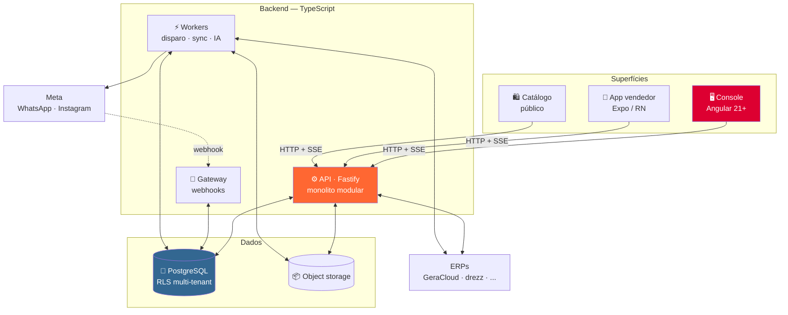

# GeraCRM

**O CRM que atende, vende e prova o próprio retorno.**

Atendimento multicanal por WhatsApp e Instagram, funil por recompra, campanhas em massa com receita
atribuída e pedido montado dentro da conversa — para venda B2B recorrente.

*TypeScript de ponta a ponta · Console Angular · App Expo · API Fastify · PostgreSQL multi-tenant*

---

## Por que o GeraCRM existe

O mercado brasileiro de CRM com WhatsApp está dividido: quem faz atendimento não faz gestão
comercial, quem faz funil não faz disparo com medição, e quem integra ERP não conversa com o
cliente. O resultado é que a operação de atacado compra duas ou três ferramentas e cola tudo com
planilha.

O estudo que originou o produto está em [`docs/estudo-crms-whatsapp.md`](docs/estudo-crms-whatsapp.md)
e [`docs/concorrentes-tailor.md`](docs/concorrentes-tailor.md). As conclusões que definem o projeto:

- **Atribuição de receita é o diferencial que ninguém entrega bem.** Campanha, tarefa e IA precisam
  mostrar quanto geraram, com custo e retorno.
- **O funil de venda recorrente não é por etapa de negociação** — é por quantidade de pedidos, com
  segmentação RFV por baixo.
- **A vertical inteira ignorou atendimento estruturado**: ninguém tem setores, SLA ou CSAT.
- **Nenhum concorrente é multi-tenant/white-label.** Campo vazio.

## O produto

| Bloco | O que entrega |
|---|---|
| 💬 **Atendimento** | Inbox multicanal com frota de números, fila pull, janela de 24h visível, protocolo |
| 👤 **Cliente unificado** | Um cadastro por CNPJ com múltiplos telefones, nomes e pessoas; opt-out granular |
| 📊 **Inteligência RFV** | 11 faixas de segmento **com histórico temporal**, ciclo de vida configurável |
| 🎯 **Funil de recompra** | Kanban por quantidade de pedidos, carteira com histórico, motivo de perda |
| ✅ **Fila do dia** | O sistema decide com quem falar hoje, por quê, e entrega a mensagem pronta |
| 🛒 **Pedido assistido** | Grade, tabela de preço e estoque ao vivo **dentro da conversa**; o ERP efetiva |
| 📣 **Campanhas** | Templates HSM, disparo pela frota, anti-ban, **receita atribuída em 3/7/14 dias** |
| 🤖 **IA** | Copiloto que escreve com contexto do cliente + agente que qualifica sozinho |
| 🔌 **Multi-ERP** | Conectores com negociação de capacidade — o produto degrada, não quebra |

### Fora de escopo (decisão, não dívida)

Loja B2B self-service, checkout do cliente final, emissão fiscal, controle de estoque e financeiro
contábil. Tudo isso é do ERP — o GeraCRM conversa com ele.

## Arquitetura

Onze diagramas explicando módulos, fluxos críticos e isolamento:
**[`docs/arquitetura-visual.md`](docs/arquitetura-visual.md)**

## Módulos

| Módulo | O que é | Tecnologia |
|---|---|---|
| [`apps/api`](apps/api) | API, gateway de webhooks e workers — três processos, um código | Fastify · Node 22 |
| [`apps/console`](apps/console) | Console de operação: inbox, CRM, campanhas, BI | Angular 21+ |
| [`apps/app`](apps/app) | App do vendedor: campo, showroom, offline | Expo · React Native |
| [`apps/catalogo`](apps/catalogo) | Catálogo público compartilhável no WhatsApp | SSR |
| [`packages/shared`](packages/shared) | Tipos, Zod e regras puras — **TypeScript puro** | — |
| [`packages/conectores`](packages/conectores) | Adaptadores de ERP com capacidades declaradas | — |
| [`packages/design-tokens`](packages/design-tokens) | Fonte da verdade visual, consumida por Angular e Expo | — |
| [`infra/migrations`](infra/migrations) | SQL numerado, à mão, aplicado no pre-deploy | — |

## Decisões que moldam tudo

| # | Decisão | Consequência |
|---|---|---|
| **ADR-001** | Multi-tenant por `tenant_id` + RLS, desde a modelagem | Isolamento garantido pela camada; white-label sem reescrita |
| **ADR-002** | WhatsApp Cloud API direto, como Tech Provider | Cliente paga a Meta; sem markup de BSP |
| **ADR-005** | Pedido nasce na conversa, ERP efetiva | Atribuição de receita **exata**, não estimada |
| **ADR-007** | Push por SSE + outbox + `LISTEN/NOTIFY` | Sem Redis, sem broker. Infra = Postgres + S3 |
| **ADR-008** | Multi-ERP com negociação de capacidade | Vende para qualquer ERP, não só o melhor |
| **ADR-010** | Angular no console, Expo no app | Cada superfície com a ferramenta certa |

Registro completo: [`docs/decisoes.md`](docs/decisoes.md)

## Documentação

<b>Descoberta e mercado</b>

- [`estudo-crms-whatsapp.md`](docs/estudo-crms-whatsapp.md) — mercado brasileiro, 12 módulos, restrições da Meta
- [`inventario-funcionalidades-referencia.md`](docs/inventario-funcionalidades-referencia.md) — sistema de referência, 38 telas
- [`concorrentes-tailor.md`](docs/concorrentes-tailor.md) — mapa competitivo em 6 anéis

<b>Produto</b>

- [`escopo-funcional-geracrm.md`](docs/escopo-funcional-geracrm.md) — ~150 funcionalidades, 15 módulos, 5 ondas
- [`backlog-epicos-geracrm.md`](docs/backlog-epicos-geracrm.md) — 27 épicos, backlog por onda, integrações
- [`especificacao-telas.md`](docs/especificacao-telas.md) — 6 telas de operação, com os 5 estados obrigatórios

<b>Técnico</b>

- [`arquitetura-visual.md`](docs/arquitetura-visual.md) — 11 diagramas
- [`stack-arquitetura.md`](docs/stack-arquitetura.md) — stack, custo, escalabilidade com gatilhos
- [`decisoes.md`](docs/decisoes.md) — ADRs
- [`aproveitamento-drezz.md`](docs/aproveitamento-drezz.md) — o que veio da stack da casa

<b>Execução</b>

- [`prontidao-para-inicio.md`](docs/prontidao-para-inicio.md) — o que falta antes da primeira linha
- [`.claude/skills/`](.claude/skills) — 34 skills: regras de código, metodologia e stack

## Estado do projeto

> **Fase de planejamento.** Nenhum código de produção escrito ainda.

O caminho crítico é externo: **registro na Meta** (Business Verification → Tech Provider Program →
App Review) leva semanas e não depende de nós. Detalhes em
[`docs/prontidao-para-inicio.md`](docs/prontidao-para-inicio.md).

## Convenções

- Prosa e domínio em **pt-BR** (`Conversa`, `Pedido`, `Campanha`); infraestrutura e comentários em inglês
- Dinheiro em **centavos inteiros**, nunca float · IDs **UUID v7**
- **Toda lista paginada** server-side por cursor — sem exceção
- **Toda migration é aditiva** — roda antes do código novo
- Regras completas: [`geracrm-arquitetura`](.claude/skills/geracrm-arquitetura/SKILL.md)

---

Gera3 · A stack e as regras vêm do <a href="https://github.com/">drezz</a>, PDV SaaS da casa.

