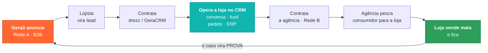
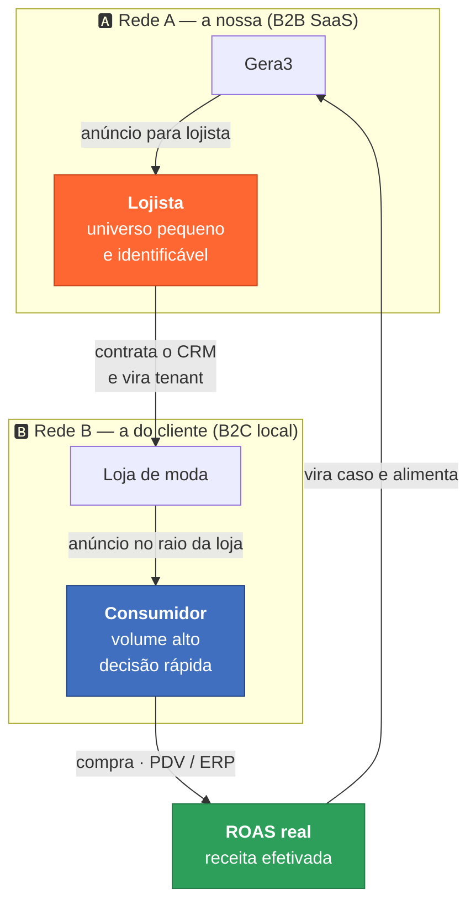
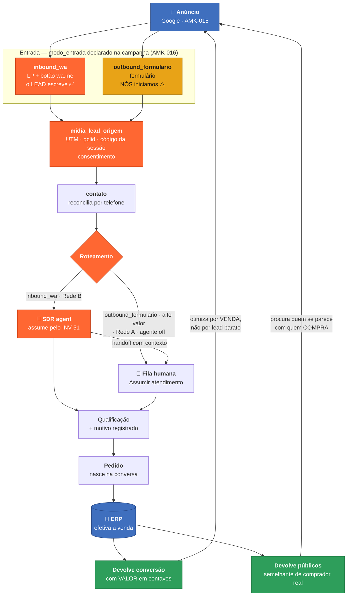
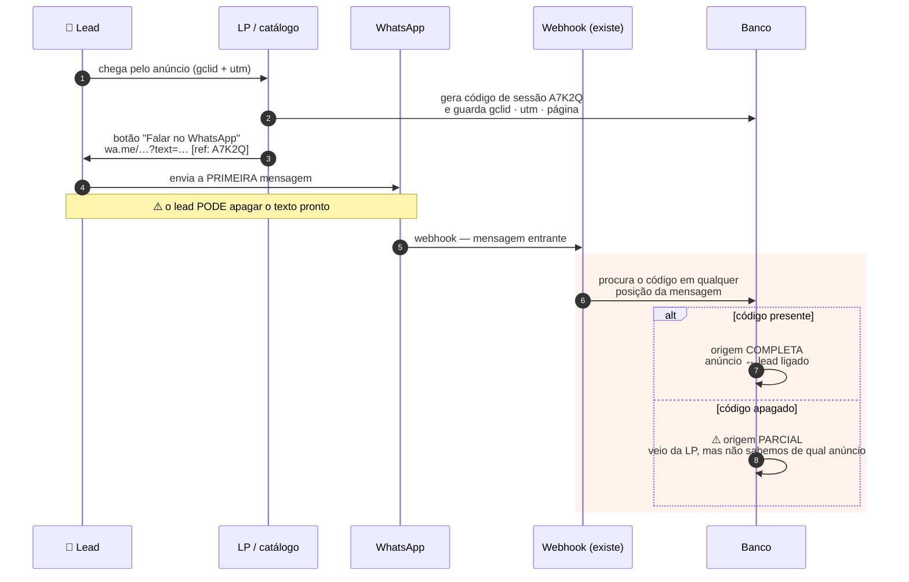
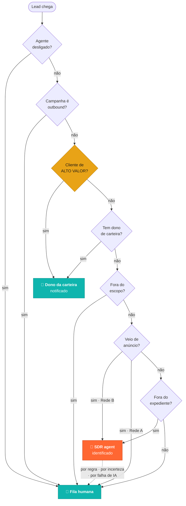
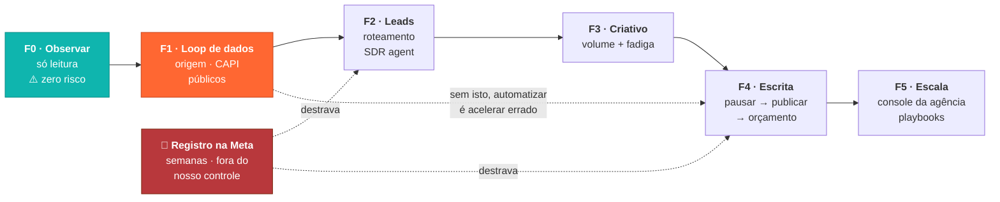

# O fluxo, em diagramas

> Mesmo padrão de `../docs/arquitetura-visual.md`. Seis diagramas, do ciclo de negócio ao instante
> mais frágil da integração.
>
> **Legenda de cor:** 🟠 laranja = **construir** (não existe) · ⬜ neutro = **já existe no GeraCRM**
> · 🔵 azul = fora do nosso controle (plataforma, ERP).

---

## 1. O ciclo — por que a família drezz é o primeiro movimento

A operação não começa vendendo para fora. Ela começa **em nós**, e cada volta produz três coisas:
receita, **prova** e dado que melhora os públicos da volta seguinte.

⚠️ **A prova é o ativo composto.** Cada loja que cresce barateia a aquisição da próxima — é o que
faz a Rede A ficar mais eficiente com o tempo sem aumentar a verba.

⚠️ **E é por isso que validar em nós vem antes.** Vender fluxo não validado é vender promessa; o
primeiro cliente da agência somos nós, e o segundo é a base que já confia no drezz.

---

## 2. As duas redes — públicos opostos, mesma máquina

⚠️ **Confundir as duas é o erro mais caro.** Ciclo, ticket, universo e formato são diferentes — o
playbook da Rede B **não** serve para a Rede A, e vice-versa.

---

## 3. O fluxo operacional, ponta a ponta

O que a operação faz com um lead, do anúncio até o sinal voltar para a plataforma.

⚠️ **A coluna do meio já existe inteira** — `contato`, fila, assunção atômica, qualificação, pedido,
ERP. O que falta é a **borda**: a entrada (origem) e o **retorno do sinal**.

⚠️ **O retorno é o produto.** Sem as duas setas de baixo, a plataforma continua otimizando por lead
barato e a operação vira agência comum.

---

## 4. O instante mais frágil da integração

Sem CTWA (AMK-012), a origem do lead viaja num **código dentro da mensagem pronta** do link `wa.me`.
É o nosso `ctwa_clid`, feito à mão — e ele é **editável pelo lead**.

⚠️ **A taxa de código perdido é métrica de saúde, não detalhe.** Se ela sobe, a atribuição está
furando — e o sintoma é silencioso: o lead entra, a conversa acontece, a venda acontece, e o anúncio
não recebe o crédito. É o AQ-45.

⚠️ **É o preço de AMK-012.** O `ctwa_clid` da Meta chega no protocolo e não dá para apagar; o nosso
depende de o lead não editar a mensagem. Mais frágil, e funciona sem registro nenhum.

---

## 5. O roteamento — agente ou humano

Regras avaliadas **em ordem**, em código. A primeira que casar decide. ⚠️ O padrão é **humano**.

⚠️ **Regra 3 é inegociável.** O CRM sabe o RFV no instante da chegada — somos a única operação de
mídia que *pode* saber isso. Trocar a relação com o melhor cliente por um minuto de vendedora
economizado é péssimo negócio.

⚠️ **O agente assume pelo mesmo INV-51 que uma pessoa.** Não há caminho paralelo: agente desligado
simplesmente não assume, e tudo cai na fila. Degradar é o padrão, não a exceção.

---

## 6. As fases e o que cada uma destrava

⚠️ **O registro na Meta começa na F0**, não na F2 — ele leva semanas, não depende de nós, e destrava
duas fases. É a mesma lição que `../docs/prontidao-para-inicio.md` já tinha aprendido no CRM.

⚠️ **F1 antes de F4** não é preferência de ordem: é a diferença entre otimizar por venda e otimizar
por lead barato.
