# Arquitetura visual do GeraCRM

> Diagramas para entender o sistema sem ler os dez documentos. Cada um responde **uma** pergunta.
> Detalhes em `stack-arquitetura.md`, `decisoes.md` e `modelo-de-dados.md`.
> Sintaxe Mermaid — renderiza no GitHub.

---

## 1. Contexto — quem fala com o quê

**Pergunta:** onde o GeraCRM se encaixa no mundo do cliente?

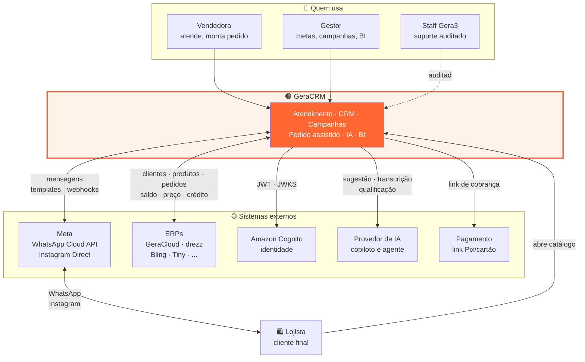

⚠️ **O lojista nunca acessa o GeraCRM diretamente** — exceto pelo catálogo público. Ele conversa
pelo WhatsApp dele. Isso é o que torna o produto invisível para o cliente final e obrigatório para
a vendedora.

---

## 2. Containers — o que roda onde

**Pergunta:** quais são as peças que se implantam separadamente?

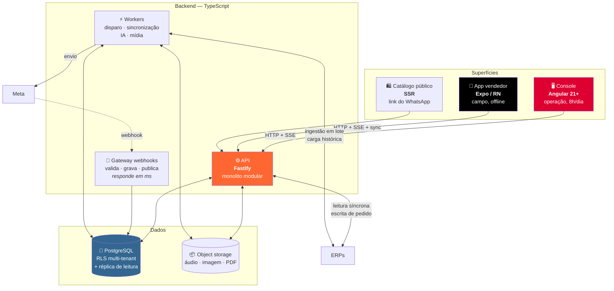

**Por que só estes três processos de backend:** cada um tem perfil de carga genuinamente diferente.
O gateway responde em milissegundos porque a Meta reenvia o que demora. Os workers rodam por horas.
A API atende requisições curtas que o usuário sente. Tudo o mais é **módulo dentro da API**.

---

## 3. Contextos de domínio

**Pergunta:** como o código é dividido por capacidade de negócio?

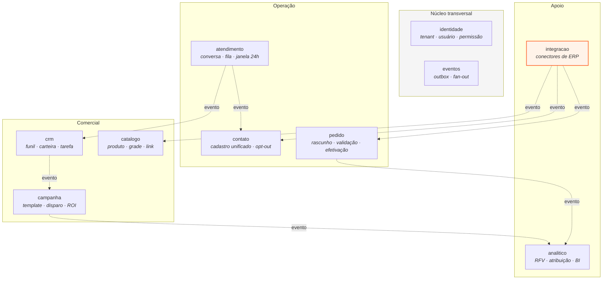

**Regras que o diagrama expressa:**

- ⚠️ Um contexto **nunca importa código interno de outro**. As setas são **eventos de domínio
  pós-commit**, nunca chamada direta.
- ⚠️ **Só `integracao` conhece formato de ERP.** Se `pedido` souber que existe um campo com o nome
  que o GeraCloud usa, a abstração multi-ERP já vazou.
- Referência entre contextos é **por id**, nunca por join de objeto.

---

## 4. 🔴 Fluxo crítico — mensagem chega e aparece na tela

**Pergunta:** como uma mensagem do WhatsApp vira um evento na aba certa, sem vazar para outra empresa?

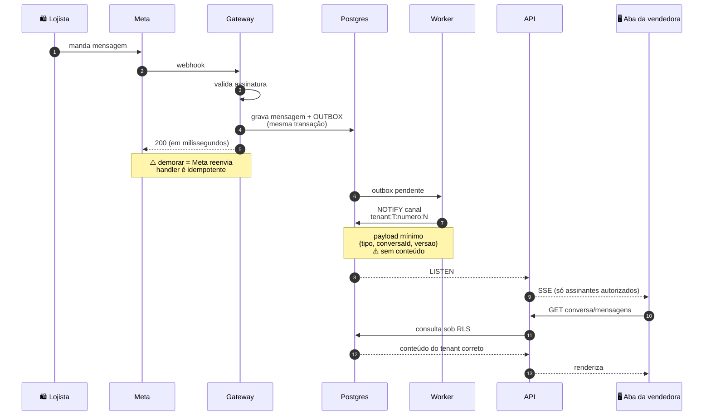

**As três defesas contra vazamento, visíveis no fluxo:**

| # | Defesa | Onde |
|---|---|---|
| 1 | Canal prefixado por tenant, montado por função única | passo 6 |
| 2 | Autorização revalidada a cada subscrição | antes do passo 8 |
| 3 | **Payload sem conteúdo** — o conteúdo vem por API sob RLS | passos 7 e 9–11 |

⚠️ Se o fan-out errar o alvo, o intruso recebe um ID que **não consegue resolver**. É a diferença
entre um bug e um incidente.

---

## 5. Fluxo — pedido assistido

**Pergunta:** como a vendedora fecha o pedido sem sair da conversa?

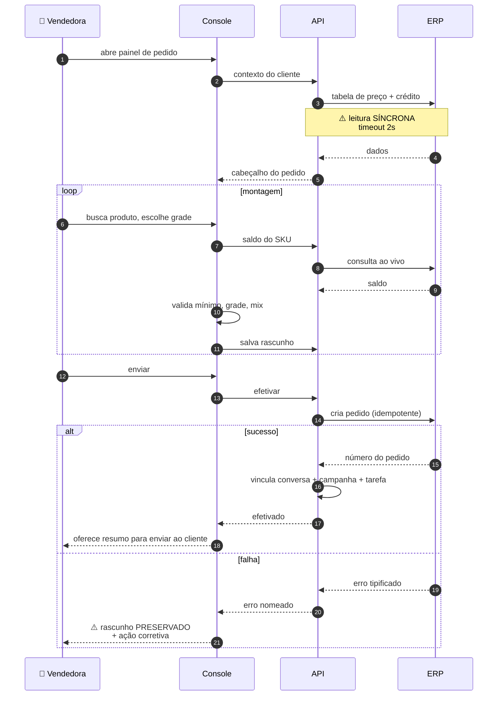

⚠️ **O ramo de falha é o que decide se o módulo é usado.** Se a vendedora perde o pedido montado,
ela volta a lançar no ERP e abandona a ferramenta. Cinco erros tratados: estoque esgotado, crédito
bloqueado, item inativado, cliente sem cadastro fiscal, falha de comunicação.

**Ganho colateral:** o vínculo do passo 14 é o que torna a **atribuição de receita exata**, em vez
de estimada por janela de 3/7/14 dias.

---

## 6. Multi-ERP — porta e capacidades

**Pergunta:** como o produto vende para clientes com ERPs de qualidade muito diferente?

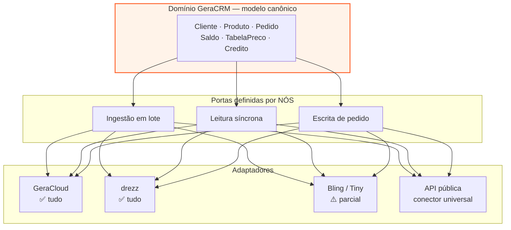

**Degradação por capacidade — o produto adapta, não quebra:**

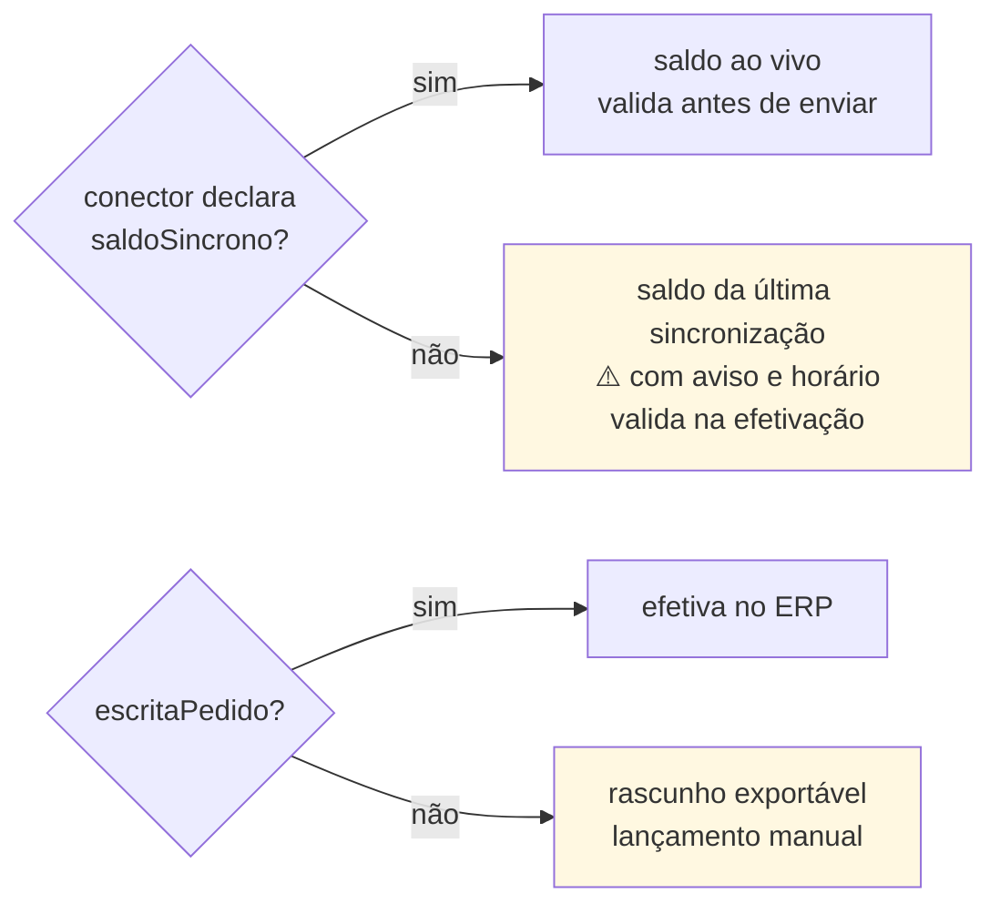

⚠️ **A capacidade é visível na interface.** Usuário de ERP limitado precisa saber *por que* o saldo
tem hora — senão conclui que o produto está errado.

---

## 7. Isolamento multi-tenant — as camadas

**Pergunta:** o que impede a empresa A de ver dado da empresa B?

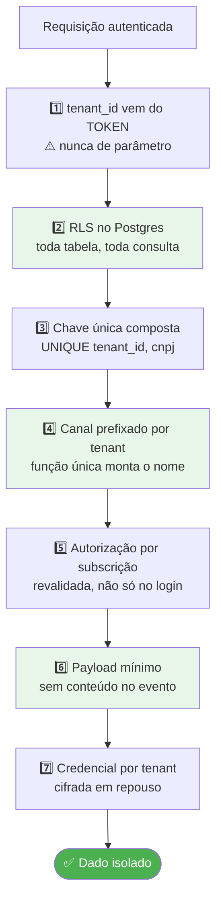

**Testado, não presumido:** todo repositório tem caso com dois tenants; todo canal também. Ver
`geracrm-testes`.

---

## 8. Camadas — a regra de dependência

**Pergunta:** onde cada tipo de código mora?

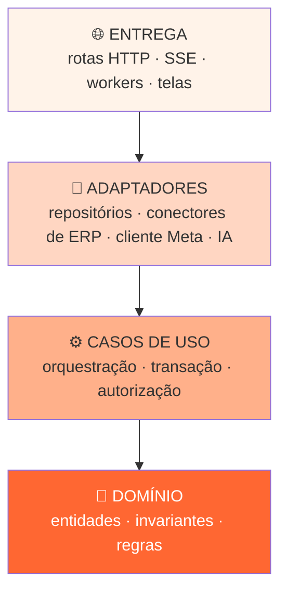

**Teste prático:** abra um arquivo de domínio. Se houver import de framework, ORM, HTTP ou SDK
externo, a regra foi violada.

⚠️ **Falha de negócio é retorno tipificado, não exceção.** Estoque insuficiente e crédito bloqueado
são resultados esperados — a tela precisa deles nomeados.

---

## 9. Monorepo e deploy

**Pergunta:** o que dispara qual deploy?

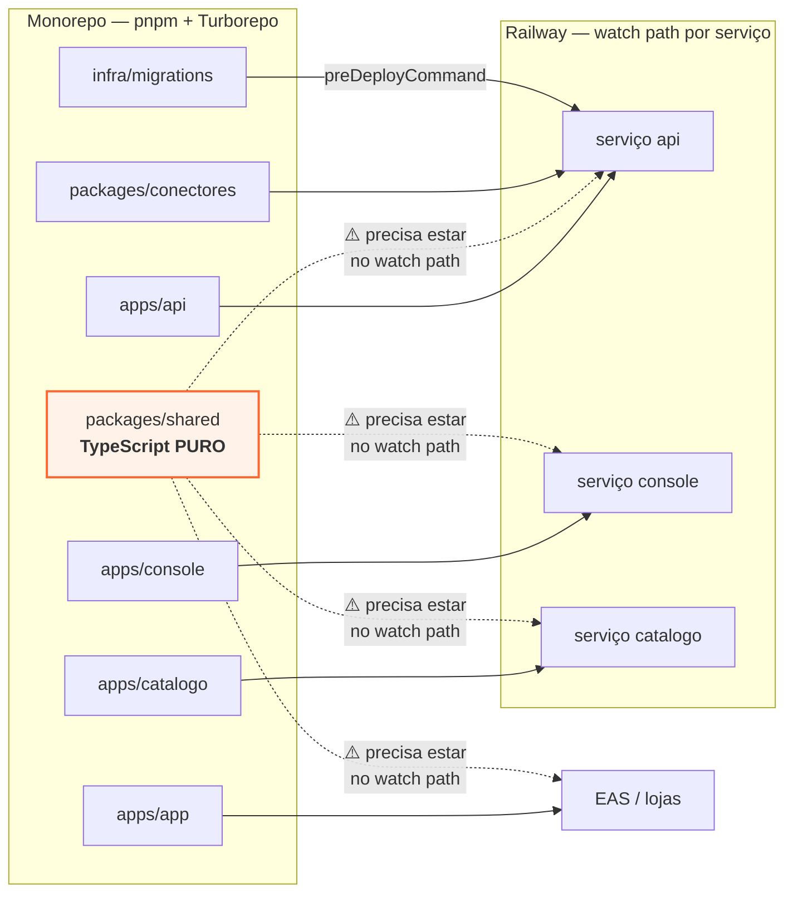

⚠️ **A armadilha herdada do drezz:** se um front importa `packages/shared` e o watch path não o
inclui, **o tipo muda na API e não muda na tela**. Deploy verde, comportamento errado, ninguém
entende por quê.

⚠️ **`packages/shared` é TypeScript puro** — consumido por Angular, Expo e API ao mesmo tempo.
Um import de framework quebra dois dos três.

---

## 10. Ondas de implementação

**Pergunta:** em que ordem isso é construído, e quando dá para cobrar?

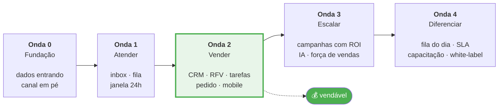

**Dependências que não podem ser invertidas:**

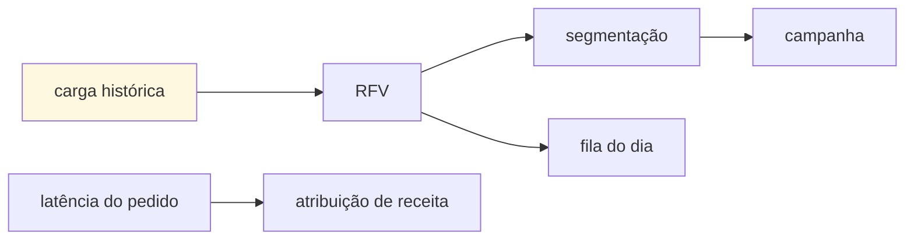

⚠️ **RFV sem carga histórica nasce vazio** — e o produto perde o argumento central.
⚠️ **Campanha antes de segmentação** vira disparo para todos, que é o que os concorrentes baratos fazem.

---

## 11. Mapa de documentos

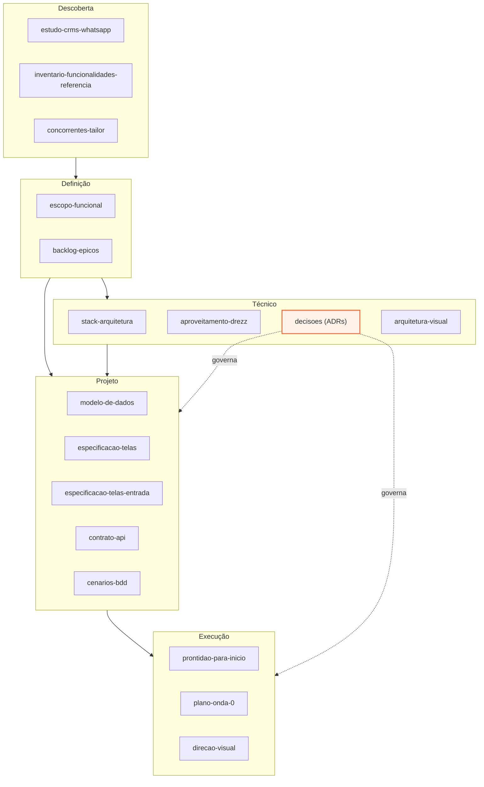

---

## Como manter estes diagramas

- ⚠️ **Diagrama desatualizado mente com autoridade** — pior que não existir.
- Mudou ADR? Confira os diagramas 2, 3, 6, 7 e 9.
- Contexto de domínio novo? Diagrama 3.
- Fluxo crítico alterado? Diagramas 4 e 5 — são os que mais explicam o sistema para quem chega.
- Mermaid é texto: entra no diff, e revisão de PR pega diagrama que não bate com o código.
