# GeraCRM — Plano de execução da Onda 1 (Atender — e a entrada do primeiro cliente)

> Deriva de [`plano-ondas-1-4.md`](./plano-ondas-1-4.md) §3 (que era macro e deixou de bastar),
> [`entrada-do-primeiro-cliente.md`](./entrada-do-primeiro-cliente.md) (executado **aqui**),
> [`plano-onda-0.md`](./plano-onda-0.md) (formato, migrations e passivos),
> [`decisoes.md`](./decisoes.md) (ADR-013, ADR-014, **ADR-015**),
> [`metricas-de-sucesso.md`](./metricas-de-sucesso.md), [`modelo-de-dados.md`](./modelo-de-dados.md),
> [`biblioteca-componentes.md`](./biblioteca-componentes.md) §7 e
> [`especificacao-telas.md`](./especificacao-telas.md) §1, §7, §9.
>
> **Objetivo da onda:** largar a ferramenta antiga. Primeiro nós, depois o cliente. A tela existe
> para isso e só para isso — se a vendedora abre o WhatsApp Web no dia 8, a onda não entregou nada.

**Entrega:** EP-05 (inbox e conversa) · EP-06 (fila e assunção) · EP-07 (governança e auditoria) ·
EP-03 cont. (saúde do número) · EP-04 cont. (opt-out, campos, "está no telefone") · EP-02 cont.
(documentação da API, webhooks de saída, painel de sync, CSV) · **e a transição do primeiro cliente,
que é escopo, não overhead**.

🔴 **Pelo ADR-015, é aqui que o cliente real entra.** A Onda 0 fechou com números da Gera3. Esta onda
não é "só atender": ela contém o cronograma inteiro de `entrada-do-primeiro-cliente.md` §7 — carga
conciliada, corte seco por número (ADR-014), treinamento, gate e rollback — com semana, dono e
critério.

---

## 0. Como ler este documento

Cinco frentes, donos diferentes, e uma delas não é engenharia:

| Frente | Prefixo | Bloco | Depende de |
|---|---|---|---|
| **BC** — Biblioteca de componentes | `BC-xx` | §3 | R-12 (Onda 0, bloco 1) |
| **D** — Migrations | `D-19…D-23` | §4 | R-07 (runner) + §4.1 |
| **Épicos novos** | `E5-xx`, `E6-xx`, `E7-xx` | §5 | BC, D |
| **Épicos continuados** | `E2-22…`, `E3-16…`, `E4-10…` | §5 | Onda 0 |
| **TX** — Transição do cliente | `TX-xx` | §2 | Meta (M-05/M-07/M-13), cliente, ERP |

⚠️ **A numeração dos épicos continuados CONTINUA — não recomeça.** `E3-16` é a décima sexta tarefa do
EP-03, não a primeira da Onda 1. Recomeçar em `E3-01` faz um mesmo identificador significar duas
coisas em dois documentos — que é exatamente o erro que `entrada` §2.5 já teve de corrigir com
`ENS-1`/`ENS-2` contra `E1`/`E2`.

⚠️ **O bloco da transição usa `TX-`, não `C-`.** `C-01…C-07` já são as perguntas sobre pessoas da
ficha de entrada (`entrada` §1.C), e `F-01…F-06` são as da Meta. Prefixo reaproveitado é ambiguidade
com data marcada.

---

## 1. Objetivo e critério de saída

**O critério da Onda 1 é duplo, e as duas metades têm ordem:** primeiro a Gera3 larga a ferramenta
antiga (dogfooding, com nossos próprios números da Onda 0), depois o cliente. ⚠️ **Inverter é
descobrir com uma vendedora atendendo lojista o que se descobriria com a gente.**

| # | Critério | Como se prova |
|---|---|---|
| **1** | **(a) A Gera3 opera 10 dias úteis dentro do GeraCRM**, sem WhatsApp Web, nos números da Onda 0 | Conciliação painel Meta × `mensagem` (**E3-21**) sem divergência, e lista de lacunas ("o que a antiga faz e a nossa não") **fechada item a item**. ⚠️ É o gate para tocar em número de cliente — não é ensaio, é pré-requisito |
| **2** | **(a) Por 10 dias úteis consecutivos, não existe mensagem faturada no painel da Meta sem linha correspondente em `mensagem`** — agora no tenant do cliente | Mesmo comando (E3-21), executado no tenant do cliente. ⚠️ **Divergência = alguém está usando o WhatsApp Web.** É o critério que não aceita opinião — e ele só começa a contar depois de `ultimo_corte` |
| **3** | **(a) A ferramenta antiga teve acesso revogado ou contrato cancelado** | `tenant_marco.abandono_sistema_antigo` gravado. ⚠️ **Nunca antes de D+30 do último lote** (ADR-014, `entrada` §4 regra 5) — este critério fecha **fora** do cronograma de desenvolvimento (§7) |
| **4** | **(b) A frota inteira do cliente está cortada e operando** | `tenant_marco.primeiro_corte` e `ultimo_corte` gravados; **MA-02 = 100%** (todo número conectado com tráfego no dia); cada lote com gate D+7 aprovado e registrado em `diario-da-migracao.md` |
| **5** | **(b) Zero conversa órfã** | Toda conversa com mensagem entrante no período tem `atendimento` com dono ou está visível na fila. Consulta `.sql` versionada, rodada no fechamento |
| **6** | **(b) Zero evento entregue a tenant errado**, e suíte de isolamento de canal SSE verde | `geracrm-tempo-real` + log do período. A suíte já é gate de PR desde R-08; aqui ela é gate de **fechamento de onda** |
| **7** | **(b) RC final assinado** (T+6) sem DIV bloqueante, e **MO-07/MO-08 medidos contra LB-11/LB-12** | `conciliacao-<data>.md` assinado pelo gestor comercial + consulta versionada das métricas. ⚠️ **A régua veio congelada da Onda 0 (MN-01): esta onda a USA, não a captura** |
| **8** | **(b) MA-04 (vazamento) ≤ 15% e caindo** | Contatos com venda no período e **sem conversa** no CRM. É o único proxy possível de "atendeu por fora" (TR-07) — e sem ele o critério nº 2 mede só o que passou pela nossa API |

⚠️ **O critério nº 1 não existia nos documentos anteriores e é o mais barato dos oito.** A Onda 0
provou que o canal sobe; ela não provou que dá para *trabalhar* oito horas dentro dele. Descobrir que
falta "marcar não lido" com uma vendedora do cliente na linha custa uma semana de confiança;
descobrir com a gente custa um card.

### 1.1 Duração — calculável, não estimada

`plano-ondas-1-4` §0.2 estima **8 semanas + 2 de corte da frota**. ⚠️ **Subestima**, e dá para saber
por quê sem chutar:

| Trecho | Semanas | O que manda |
|---|---|---|
| **S0** — pré-onda | 1 | Bloco 2 da biblioteca e o protótipo de alta fidelidade (§3) |
| **S1…S6** — construção | 6 | Front. O back que a onda consome já existe desde a Onda 0 |
| **S7 (= T)** — corte do piloto | 1 | `entrada` §3.1, fase 1 |
| **S8…S12 (= T+1…T+5)** — lotes | **1 por filial** | `entrada` §3.1: ⚠️ **nunca dois lotes na mesma semana** |
| **S13 (= T+6)** — fechamento | 1 | D+30 do piloto, RC final, retrospectiva |
| **cauda administrativa** | +4 | D+30 do **último** lote → só então o critério nº 3 pode fechar |

**A única variável é o número de filiais (A-07), e ele é conhecido desde a ficha de entrada.** Com
uma filial: ~10 semanas + cauda. Com quatro: ~13 + cauda.

⚠️ **A cauda é a parte que some do plano.** Declarar a onda encerrada em S13 com o contrato antigo
ainda ativo é declarar encerrado o único critério cuja prova é administrativa — e é exatamente o
cenário do TR-11 (cliente cancela cedo para economizar) acontecendo pelo motivo oposto: ninguém
cancelou nunca.

---

## 2. 🔴 A entrada do primeiro cliente — bloco próprio

Executa `entrada-do-primeiro-cliente.md` inteiro. **Não repete o documento: aponta para ele e diz
quando, quem e o que prova.**

### 2.1 ⚠️ O que já tinha de ter acontecido antes desta onda abrir

| # | Item | Quando rodou | Se não rodou |
|---|---|---|---|
| **TX-02** | **Janela de sombra** (LB-10, LB-11, LB-12) — 2 semanas medindo o **sistema antigo**, antes de a equipe saber da mudança | **T-8, na Onda 0** | 🔴 **Não há remédio.** A janela fecha no `primeiro_corte` e não reabre. Sem ela, MO-07 e MO-08 desta onda não têm contra o quê ser lidos, e toda melhora vira opinião. ⚠️ **É o único item deste plano que pode inviabilizar o critério nº 7 antes da primeira linha de código** |
| **TX-01** | **Ficha de entrada** (`entrada` §1.A/C/D/E/F/G) assinada | T-6, na Onda 0 | Sem ela não existe data de go-live — e o dimensionamento do corte (filiais, vendedoras, números) é chute |
| **M-13** | Situação dos números na Meta (F-02) | T-6, na Onda 0 | ⚠️ Portabilidade entre WABAs depende do **concorrente que está perdendo o cliente**, com até 3 semanas de espera. Descobrir agora é atrasar o corte, não o desenvolvimento |
| **MN-01** | Linha de base congelada com `congelado_em` e conferida com o cliente | Onda 0 | Critério de saída nº 5 da Onda 0 — se ficou aberto, ele é dívida **desta** onda, e vence antes de S7 |

⚠️ **Abrir a Onda 1 sem TX-02 fechada é decisão, não acidente — e precisa ser registrada como tal**,
com a consequência escrita: *"a Onda 1 será avaliada sem linha de base de atendimento"*. Escondê-la
é o que transforma um dado perdido em discussão de mérito seis meses depois.

### 2.2 Tarefas da transição

| # | Tarefa | Quando | Dep. | Definição de pronto |
|---|---|---|---|---|
| **TX-03** | Entregar `perfilamento.md` (E2-17) e **`o-que-nao-migra.md` assinado pelo gestor comercial** | S1 | E2-17 | ⚠️ Assinado **antes** da carga. Quem mostra a bagunça da base antes de importar não é culpado por ela depois |
| **TX-04** | **ENS-1** — ensaio de carga em homologação, sobre a base real | S2 | E2-07, M-10 | Duração medida. ⚠️ **É ela que define a janela do go-live** — prometer data antes de medir é a origem do go-live que vira madrugada. Janela com **3× folga** sobre o medido (TR-08) |
| **TX-05** | **RC v1** + toda linha classificada em DIV | S3 | E2-16 | Nenhuma linha "a investigar". ⚠️ Divergência sem nome vira "coisa do sistema novo" |
| **TX-09** | Templates de reabertura **recriados** (não importados) e submetidos | S4 | E3-15 | Aprovados pela Meta e sincronizados por E3-15. ⚠️ Template pertence à WABA, não ao número: os da ferramenta antiga não vêm |
| **TX-10** | Pendências do cliente: PIN de 2 etapas (F-03), **método de pagamento na conta Meta** (F-04), display name (F-05), admin do BM (F-01) | S4 | ficha | ⚠️ Dono é o **cliente**. Sem método de pagamento o número não envia, e a falha aparece como "erro ao enviar" se E3-16 não estiver pronto |
| **TX-08** | **Treinamento B1/B2/B5 + certificação prática** (`entrada` §5.4) | **S5** | E5-04…E5-11, E6-01, E4-17 | As **seis** ações certificadas em homologação: responder na janela · reconhecer janela fechada e enviar template · buscar cliente · ouvir áudio · abrir a ficha e ler o histórico de compra · registrar comentário. ⚠️ **Não antes de S5** — certificar numa tela que não existe é ensaio de teatro |
| **TX-06** | **ENS-2** — carga de produção + **RC v2 assinado** | S6 | TX-04, TX-05 | Assinado pelo **gestor comercial**, não pelo TI. ⚠️ TI assina que o job rodou; só o comercial assina que o faturamento é aquele |
| **TX-14** | **Critério de rollback aprovado por escrito** (RB-01…RB-07), decisor nomeado (C-07), prazo de decisão de 24 h | **S6, antes de S7** | — | ⚠️ **É a decisão da §7.3 de `plano-ondas-1-4` que esta onda cobra.** Rollback sem critério escrito é decisão tomada no desespero |
| **TX-15** | **Runbook de operação pós-go-live**: plantão, escalonamento, incidente com o cliente dentro, quem atende às 8h de segunda | S6 | — | ⚠️ Lacuna declarada em `entrada` §9.5: *"este documento cobre a entrada; o dia seguinte ainda não tem dono"*. **Esta onda é onde o dia seguinte começa** |
| **TX-07** | **Delta de véspera** — recarga por janela de data desde ENS-2 | S7 (D-0) | E2-18 | `dada recarga de 01/03 a 07/03, então só a janela é reprocessada e nada duplica` |
| **TX-11** | **Corte do número piloto** (ADR-014) | **S7 = T** | TX-06…TX-10, E5-07 | Checklist `entrada` §3.4 inteiro: fora do pico, carta de despedida, registro na Cloud API, webhook verificado, **3 testes de ida e volta** (texto, imagem, áudio, status), custo gravado inclusive a linha de **zero centavos**, B3, monitoramento presencial da primeira hora. `tenant_marco.primeiro_corte` gravado |
| **TX-12** | **Lotes 2…N**, um por semana, com gate D+7 | S8…S12 | TX-11 | ⚠️ **Nunca dois lotes na mesma semana** — o que falha no lote 2 precisa ser distinguível do que falha no lote 1. `tenant_marco.ultimo_corte` ao fim |
| **TX-13** | **B4** (carteira, ficha, comentário, tarefa) em D+3 do lote e **B6** em D+30 | S9, S13 | TX-11 | ⚠️ B4 vem **depois** do corte, deliberadamente: antes, a vendedora está preocupada em não perder cliente e não retém nada |
| **TX-16** | `diario-da-migracao.md` alimentado a cada gate e a cada rollback | contínuo | — | Data, número, gatilho, decisão, decisor. ⚠️ Sem diário, o segundo cliente repete os mesmos erros e ninguém sabe explicar por quê |

### 2.3 ⚠️ Quem é o número piloto, e por que a escolha é do plano e não da simpatia

A vendedora de volume **mediano**, alta disposição, presente fisicamente na sede (`entrada` §3.1).

- **Não é a melhor** — põe o maior faturamento no maior risco, e é justamente quem mais perde com o
  histórico de conversa zerado (TR-09).
- **Não é a pior** — contamina a avaliação: tudo que der errado será atribuído ao sistema, e tudo que
  der certo, a ela.

### 2.4 O que o corte faz com as conversas — e a consequência que surpreende

No minuto do corte **todas as janelas de 24 h estão fechadas** (a janela é derivada do último inbound
recebido **pela nossa API**, e nasce zerada). A vendedora no meio de uma negociação **não consegue
responder livremente** — só template aprovado. Ela não perdeu o cliente; perdeu a permissão de falar
primeiro em texto livre.

Daí três regras não negociáveis, todas com tarefa nesta onda: corte **fora do horário de pico**
(TX-11) · **carta de despedida** nas conversas ativas antes do corte (TX-11) · ⚠️ **nenhum disparo em
massa nos primeiros 14 dias de cada número** (TR-05) — que nesta onda é fácil de cumprir porque
campanha não existe (§9), e difícil de cumprir na Onda 3, quando existir.

---

## 3. Pré-onda — a biblioteca de componentes (S0)

`plano-ondas-1-4` §2, dependência nº 5: **token sem componente não constrói tela.** O bloco 1 nasceu
na Onda 0 (R-12); o bloco 2 é desta onda e **precede** o EP-05.

| # | Tarefa | Dep. | Definição de pronto |
|---|---|---|---|
| **BC-01** | ⚠️ **Protótipo de alta fidelidade do inbox, ANTES do bloco 2 inteiro** (`direcao-visual` §9) | R-12 | ⚠️ É onde a densidade quebra — e é mais barato descobrir num protótipo do que em oito componentes já escritos duas vezes |
| **BC-02** | **Bloco 2** — avatar · **anel de janela** · balão · composer · player de áudio · seletor de número · abas · banner | BC-01, R-12 | As telas de `especificacao-telas` §1 montadas **sem um `#hex` no código**; o lint de cor literal (R-12) continua verde |
| **BC-03** | ⚠️ **`gc-anel-janela` consome a função pura de `shared`** (E3-10), nunca recalcula | E3-10 | `dado 23 h 59 min, então o anel e o servidor concordam`. ⚠️ **O texto nunca some** — cor não pode ser a única fonte da informação (ADR-012, `biblioteca` §1.1) |
| **BC-04** | Restante do **bloco 3** que a Onda 0 não consumiu: chip de filtro, toggle | R-12 | Usados por E5-08 e E4-13 |
| **BC-05** | Tema claro/escuro ligado a `usuario_preferencia.aparencia` | D-21 | Trocar o tema não recarrega a aplicação e não perde o estado da conversa aberta |
| **BC-06** | `apps/catalogo` deixa de ser stub: cada componente com os **cinco estados** navegáveis | BC-02 | ⚠️ É o mecanismo que impede o segundo botão. Catálogo que não existe é catálogo que ninguém consulta antes de escrever `<button>` |

⚠️ **Pendências que esta onda precisa fechar e a biblioteca deixou com dono aberto**
(`biblioteca-componentes` §7): conjunto de ícones e licença · atalhos de tecla única (`/`, `j`, `k`,
`e`) que **não podem disparar com foco no composer** · som de mensagem nova e notificação de desktop
(vira **E7-05**) · indicador de presença (⚠️ fica **fora** — ver §9).

---

## 4. Migrations da onda

Continuam de onde a Onda 0 parou: a última foi **D-18 / `0018_conciliacao.sql`**. ⚠️ **Esta tabela é
a reserva de número**, pelo mesmo motivo da §4 do plano da Onda 0 — migration prevista em documento
também reserva número, e a colisão do `0017` nasceu no planejamento, antes de existir PR.

| # | Arquivo | O que cria | ⚠️ Ponto de atenção |
|---|---|---|---|
| **D-19** | `0019_canal_operacao.sql` | `canal_configuracao` (horário de atendimento, mensagem de ausência, assinatura, **`disparo_pausado`**, motivo, `pausado_em`) · `metrica_numero_dia` (enviadas, entregues, lidas, falhas, custo) + RLS | ⚠️ **`canal_configuracao` está atrasada e o atraso tem consequência automática.** A tarefa **I-10 da Onda 0** promete que MT-01 *"pausa `canal_configuracao.disparo_pausado` sozinho"* — e a tabela não nasce na `0011`. **Se a Onda 0 ainda estiver aberta, ela desce para uma `0011c`**; se já fechou, MT-01 alerta mas não pausa até este deploy, e isso é `metricas-de-sucesso` §4 sendo violado (*contra-métrica que depende de alguém olhar o gráfico não protege nada*). ⚠️ **Em qualquer dos dois casos o número `0019` não é reciclado** |
| **D-20** | `0020_contato_superficie.sql` | `campo_personalizado` (definição, CTT-06 — o **valor** continua em `contato.campos jsonb`) · **`contato_canal`** (projeção CTT-07) · colunas de CTT-05 (`classificacao_comercial`, `qualificacao`, `qualificado_em`, `qualificado_por_id`, `qualificacao_origem`) e as de CTT-08 que faltarem | ⚠️ **`contato_canal` é uma divergência declarada:** a §7 do `plano-onda-0.md` afirma que ela *"existe desde a Onda 0"*, e a `0009` não a cria. **Ela é reconstituível** — `conversa` tem `UNIQUE(tenant_id, canal_id, contato_id)` —, então a migration traz **backfill a partir de `conversa`** no mesmo arquivo. ⚠️ Sem o backfill, "está no telefone" só conhece o que aconteceu depois do deploy, e a vendedora vê badge vazio num contato com dois anos de conversa |
| **D-21** | `0021_governanca.sql` | `notificacao` (PLT-07) · `usuario_preferencia` (`aparencia`, `escopo_ativo`, `notificacoes`, `assinatura`) · `usuario_sessao` · `usuario_perfil` + RLS nas quatro | ⚠️ `usuario_preferencia.escopo_ativo` é a **exigência 23** das telas (filial e número ativos) e mora no **servidor**, não no navegador: a vendedora troca de máquina e o escopo tem de vir junto. ⚠️ `usuario_sessao` existe para **revogar durante a sessão** (E7-06) — sem ela, revogar permissão vira "esperar o refresh do token", que é exatamente o que a §2.2 da Onda 0 recusou |
| **D-22** | `0022_integracao_superficie.sql` | `webhook_assinatura` (URL, **segredo cifrado**, eventos, ativo) · `webhook_entrega` (payload, status HTTP, tentativa, erro) · `importacao_arquivo` (tipo, chave de objeto, mapeamento `jsonb`, estado, linhas total/ok/erro) · `importacao_linha_erro` + RLS | ⚠️ **`importacao_arquivo` e `importacao_linha_erro` não existem no `modelo-de-dados.md` §8** — nascem aqui e **entram no modelo no mesmo PR**, não depois. Tabela criada por migration sem entrada no modelo é a segunda fonte de verdade começando. ⚠️ `webhook_assinatura.segredo_cifrado` usa a chave de I-09; segredo de webhook em texto é credencial do cliente vazando pelo nosso banco |
| **D-23** | `0023_indices_onda1.sql` | Índices das telas desta onda: lista de conversas por canal ordenada por `ultima_mensagem_em` · **"só sem resposta"** (`ultima_direcao`, `ultima_entrante_em`) · busca por protocolo · fila (`atendimento` sem dono) · `contato_canal (tenant_id, contato_id)` · `notificacao` não lidas por usuário · GIN em `contato.campos` **só se houver busca** | 🔴 **A regra da Onda 0 muda aqui.** Lá, *"`CREATE INDEX CONCURRENTLY` não entra, porque as tabelas estão vazias"*. Agora **não estão**: a carga histórica entrou. Índice comum em `mensagem` e `venda` **trava escrita durante o deploy**, com a versão anterior servindo tráfego real. ⚠️ Exige duas coisas do runner (R-07): **migration marcada como "sem transação"** e a checagem de que o índice ficou `valid` (um `CONCURRENTLY` que falha deixa índice inválido em silêncio, e ele continua custando escrita sem nunca ser usado) |

### 4.1 Regras que continuam valendo

Todas as da §4.1 do plano da Onda 0, sem exceção: RLS `ENABLE` + `FORCE` com `USING` **e**
`WITH CHECK` na mesma migration · única composta com `tenant_id` · FK composta · dinheiro em
`*_centavos bigint` · estado em `text` com união de literais · UUID v7 na aplicação · sem partição
`DEFAULT` · schema Drizzle atualizado no **mesmo PR**.

⚠️ **E uma que só agora tem consequência: toda migration é aditiva porque ela roda com a versão
anterior atendendo tráfego.** Na Onda 0 isso era teoria — o banco estava vazio e não havia usuário.
Nesta onda há vendedora com o console aberto. Remover ou renomear coluna são **dois ou três
deploys**, e quem pular a etapa derruba a tela de quem está no meio de um atendimento.

---

## 5. Tarefas por épico

Notação: **dep.** = de quem depende · **DoD** = o teste que precisa passar (`geracrm-testes`).

### 5.1 EP-05 — Inbox e conversa (INB-01…08, INB-11)

⚠️ **A ordem interna importa e é contraintuitiva:** shell → **SSE** → lista → conversa → composer.
O SSE vem **antes** da lista, não depois. Montar a lista com `fetch` e "ligar o tempo real depois" é
reescrever o estado da tela inteira (`plano-ondas-1-4` §3.1).

| # | Tarefa | Dep. | Definição de pronto |
|---|---|---|---|
| **E5-01** | Shell do console: navegação, escopo ativo (filial + número), os **cinco estados** em toda tela | BC-02, E1-05 | Escopo ativo persistido em `usuario_preferencia` (D-21) — trocar de máquina não perde o contexto |
| **E5-02** | ⚠️ **SSE como Observable** (ADR-010 §4): `POST /v1/eventos/token` → `GET /v1/eventos?canais=…` → `subscricao.resultado`, reconexão com **cursor de versão** | E3-14, R-06 | `dado token do tenant A pedindo tenant:B:conversa:C, então o canal é recusado individualmente e a conexão continua`. `dada queda de rede, quando reconecta, então refaz a partir do cursor e nada é perdido nem duplicado`. ⚠️ Payload restrito a `{tipo, id, versao}` — o pior caso é um refetch, nunca um vazamento |
| **E5-03** | Lista de conversas com **cursor** + badges de contexto (INB-06): estágio, dono, histórico (`1 pedido`/`3+`), quem conduz, tipo do último conteúdo, não lido | E5-02, D-23 | Badges na **ordem fixa** da `biblioteca` §1.4. ⚠️ Lista paginada server-side, sem exceção (ADR-011) |
| **E5-04** | Conversa: texto, imagem, vídeo, documento, localização, contato (INB-02) | E5-03 | Mídia por **URL assinada de expiração curta** (I-05); ⚠️ nunca URL pública adivinhável |
| **E5-05** | **Áudio (PTT)**: gravação no navegador + **player inline com velocidade** (INB-03) | E5-04 | ⚠️ É o argumento nº 1 da vendedora para voltar ao celular (`entrada` §5.3). Transcrição é Onda 2 — o player **não** é |
| **E5-06** | **Anel/badge de janela de 24 h** com contagem regressiva (INB-04) | BC-03 | `dado 23 h 59 min, então a tela e o servidor concordam`. ⚠️ O servidor recusa e a tela **já sabia** — nunca o inverso |
| **E5-07** | **Bloqueio de envio livre com janela fechada + oferta automática de template** (INB-05) | E5-06, E3-15 | `dada janela fechada, quando digita texto livre, então o composer bloqueia e oferece o template aprovado, com o custo declarado`. 🔴 **É a tela do dia do corte** — no minuto do corte, 100% das conversas estão neste estado |
| **E5-08** | Triagem: **"Só sem resposta"**, ordenar por mensagem do cliente, busca por nome / telefone / **protocolo** (INB-07) | E5-03, BC-04, D-23 | Busca por telefone usa a canônica de E2-15 — `(81) 9861-7049` e `5581998617049` acham o mesmo contato |
| **E5-09** | Recorte temporal com "carregar mais 30 dias" (INB-08) | E5-04 | ⚠️ `mensagem` é **particionada mensal**: o cursor precisa atravessar partição sem varrer as demais. `dado contato com 3 anos de histórico, quando carrega mais, então o plano não toca partições fora da janela` |
| **E5-10** | **Protocolo numerado** de atendimento (INB-11) | E6-01 | Via `contador_por_tenant` com `UPDATE … RETURNING`. ⚠️ `SEQUENCE` é global e não serve (§7.1 do modelo) |
| **E5-11** | **Seletor de número da frota** (INB-01) + permissão por número (`usuario_canal`) | E5-01, D-11 | `dada vendedora sem o canal, quando abre a conversa por URL direta, então não vê` — a checagem é do **caso de uso** (E1-04), nunca do componente |
| **E5-12** | Marcar não lido / `conversa_leitura` | E5-03 | Estado por usuário, não por conversa: duas vendedoras no mesmo número têm não-lidos diferentes |
| **E5-13** | ⚠️ **O envio pela tela usa o MESMO gateway de E3-09** | E3-09 | Teste que prova que **não existe caminho de envio fora do gateway**: janela, opt-out, lista de bloqueio, pagamento e allowlist revalidados no servidor. ⚠️ Uma rota nova "só para a tela" reabre todos os invariantes de envio de uma vez |
| **E5-14** | Upload de mídia com limites de tipo e tamanho da Meta, validados **antes** do upload | E5-04, I-05 | `dado arquivo de 120 MB, quando seleciona, então recusa na tela com o limite dito` — não depois de subir |

### 5.2 EP-06 — Fila e assunção (INB-09, INB-10)

| # | Tarefa | Dep. | Definição de pronto |
|---|---|---|---|
| **E6-01** | **Fila em modo pull**: ver em leitura + botão **"Assumir atendimento"** (INB-09) | E5-03 | `dadas 50 assunções concorrentes da mesma conversa, quando disparam, então exatamente 1 vence` — pela única parcial de `atendimento` (INV-51), não por `SELECT` antes do `INSERT`. As 49 recebem erro tipificado e a tela **já atualizou por SSE** |
| **E6-02** | Abas **Meus atendimentos / Fila** com contador (INB-10) | E6-01, E5-02 | Contador atualizado por evento, não por polling. ⚠️ Polling de contador em 30 vendedoras é o primeiro lugar onde a conta de banco cresce sem ninguém notar |
| **E6-03** | `atendimento_evento` alimentado (assumido, devolvido) + auditoria | E6-01, E7-01 | `quem estava com esta conversa às 14h de terça?` sempre responde. ⚠️ **Encerrar/reabrir (INB-16) é Onda 2** — aqui o atendimento fica aberto e a fila é o que **não tem dono** |
| **E6-04** | **MO-11** instrumentado: tempo na fila até "Assumir" — p90 | E6-01, I-11 | Consulta `.sql` versionada em `contexts/analitico/consultas/` com o ID da métrica no nome |
| **E6-05** | Preencher `primeira_resposta_em` **e** `primeira_resposta_humana_em` (colunas de D-12) | E5-13, E6-01 | 🔴 `dada mensagem de ausência automática, quando enviada, então preenche a primeira e NÃO a segunda`. ⚠️ É exatamente o que **MC-05** vigia: resposta automática vazia zera o relógio e MO-07 deixa de ser lida |

### 5.3 EP-07 — Governança e auditoria (PLT-05, PLT-07)

| # | Tarefa | Dep. | Definição de pronto |
|---|---|---|---|
| **E7-01** | **Auditoria completa** (PLT-05): envio, exclusão, transferência, mudança de carteira, alteração de preço, acesso cross-tenant do staff | D-04, E1-06 | `dado staff da Gera3 abrindo conversa de cliente, então existe registro com ator, ação, alvo e origem`. ⚠️ Escrita **no mesmo commit** do fato auditado — auditoria em `try/catch` separado é auditoria que falta justamente no incidente |
| **E7-02** | Tela de auditoria com filtro por ator, alvo e período, e exportação | E7-01 | ⚠️ `auditoria` é **particionada mensal**: a tela **exige** janela de data, não oferece "tudo". Filtro sem janela é varredura de todas as partições |
| **E7-03** | **Notificações in-app** (PLT-07): `notificacao` + contador + evento em `tenant:{T}:usuario:{U}` | D-21, E5-02 | `dada permissão revogada, então a notificação de outro usuário nunca chega neste canal` |
| **E7-04** | Preferências de notificação por evento (app / push / e-mail / som) | D-21 | Gravadas em `usuario_preferencia.notificacoes`; ⚠️ o **padrão** é o que 90% vai usar — padrão barulhento é notificação desligada inteira na segunda semana |
| **E7-05** | **Som de mensagem nova** + notificação de desktop | E7-03 | ⚠️ Não toca quando a aba **já está** na conversa em foco. Pendência nº 3 da `biblioteca` §7, agora com dono |
| **E7-06** | Sessões ativas e **revogação durante a sessão** | D-21, E1-04 | `dada permissão revogada, então o canal SSE cai e a próxima request falha` — **sem esperar o refresh do token**. ⚠️ É a promessa da §2.2 do plano da Onda 0 chegando à conta |
| **E7-07** | **Política de privacidade e termos publicados**, com base legal do tratamento de conversa | jurídico | ⚠️ Não é burocracia paralela: é **requisito do App Review** (URL de política) e pré-requisito do primeiro corte |

### 5.4 EP-03 cont. — Saúde do número (CAN-04, CAN-05)

| # | Tarefa | Dep. | Definição de pronto |
|---|---|---|---|
| **E3-16** | **Painel de saúde do número** (CAN-04): tier, qualidade, conta LIVE, empresa verificada, **`pagamento OK`** | E3-13, D-19 | 🔴 `dado método de pagamento ausente na conta Meta do cliente, quando o envio falha, então a tela diz "pagamento não cadastrado na conta Meta"` — **não "erro ao enviar"** (ADR-002). ⚠️ Sem isto, a falha mais comum do dia D vira suporte às cegas |
| **E3-17** | Contadores por número (CAN-05): contatos, clientes, conversas ativas, entregues/lidas/falhas | D-19 | Sobre `metrica_numero_dia`. ⚠️ O dia é o do **fuso do tenant** e a tela **declara a hora de apuração** — nunca finge tempo real (a réplica tem lag) |
| **E3-18** | `disparo_pausado` operável na tela + consequência automática de MT-01 e MT-02 | D-19, I-11 | `dada taxa de entrega < 95% por 1 h, então o disparo daquele número é pausado pelo sistema e o gestor é avisado` — sem ninguém olhar gráfico |
| **E3-19** | Tela **"Meus Telefones"** e configurações de número (`especificacao-telas` §9): horário de atendimento, mensagem de ausência, assinatura | E3-16, D-19 | ⚠️ A mensagem de ausência configurada aqui é a que **não** pode preencher `primeira_resposta_humana_em` (E6-05) |
| **E3-20** | Nome amigável, filial e `usuario_canal` administráveis pela tela | E3-02 | É item do checklist do dia D (`entrada` §3.4) — hoje só existe por SQL |
| **E3-21** | 🔴 **Conciliação painel Meta × `mensagem`, como comando executável** | E3-12 | `dado o mês fechado, quando roda, então lista toda conversa faturada na Meta sem linha correspondente em mensagem, por número e por dia`. ⚠️ **É a prova dos critérios de saída nº 1 e nº 2** — e a única forma de ela acontecer 10 dias seguidos é ser comando, como o RC. Conferência manual não sobrevive à segunda semana |

### 5.5 EP-04 cont. — Superfície do contato (CTT-05…08, CTT-10)

| # | Tarefa | Dep. | Definição de pronto |
|---|---|---|---|
| **E4-10** | Classificação **Atacado/Varejo** e **Qualificado/Desqualificado**, com data e origem (CTT-05) | D-20 | Origem registrada (manual, ingestão, IA na Onda 3) — sem ela, "quem qualificou isso?" não tem resposta |
| **E4-11** | **Campos personalizados** (CTT-06): definição em `campo_personalizado`, valor em `contato.campos jsonb` | D-20 | Tipos texto, número, data, lista, moeda. ⚠️ **Moeda em centavos** também aqui (INV-46) — campo personalizado não é exceção. GIN **só** quando houver busca |
| **E4-12** | **"Está no telefone"** (CTT-07): badge por número, sobre `contato_canal` | D-20, E3-06 | Projeção mantida **no mesmo commit** da ingestão da mensagem. ⚠️ **Com o backfill de D-20 rodado** — badge vazio num contato com dois anos de conversa é pior que badge nenhum |
| **E4-13** | **Preferências de contato** (CTT-08): toggles independentes `Recebe Campanhas` / `Recebe Automações` | D-20, BC-04 | ⚠️ Desligar na tela **grava `consentimento_contato` com autor, origem e data** — opt-out sem lastro é o que CMP-10 proíbe, e é a primeira pergunta jurídica quando o cliente reclama |
| **E4-14** | Comentários / anotações internas (CTT-10) | D-09 | Visíveis na ficha e na coluna C do inbox |
| **E4-15** | **Opt-out e lista de bloqueio consultáveis na tela** | E2-19, E4-13 | É a superfície do que E2-19 importou. `dado bloqueio com origem='migracao', então a tela mostra de onde veio` |
| **E4-16** | **RFV-08 — qualidade cadastral** como ferramenta de higienização | E2-17 | ⚠️ **Divergência resolvida aqui: RFV-08 é Onda 1**, não Onda 3. Durante a transição ela é a resposta numérica a *"o sistema perdeu meus clientes"* (40% sem documento na base de referência) e vira meta semanal de higienização — não relatório |
| **E4-17** | **Ficha do contato** na coluna C do inbox: histórico de compra da carga, telefones, documentos, endereços, carteira | E5-04, E2-08 | 🔴 É uma das seis ações da **certificação prática** (`entrada` §5.4). Sem ela, TX-08 não fecha e o corte não acontece |

### 5.6 EP-02 cont. — Superfície de integração (INT-06…09)

| # | Tarefa | Dep. | Definição de pronto |
|---|---|---|---|
| **E2-22** | **INT-06 — documentação pública navegável** da API: campos, erros HTTP, limites, formatos, exemplos cURL | E2-11, R-06 | Os exemplos **rodam** contra homologação. ⚠️ E o **erro tipificado** está documentado — sem isso o integrador trata erro por `string.includes()`, que o ADR-011 proíbe do nosso lado e nós induzimos do lado dele |
| **E2-23** | **INT-07 — webhooks de saída**: mensagem recebida, lead qualificado, negócio mudou de etapa, campanha finalizada, tarefa concluída | D-22 | Assinatura HMAC com o segredo do tenant; reentrega com backoff; ⚠️ **falha permanente do endereço do cliente não pode travar a fila dos demais** (mesma lição de E3-05). ⚠️ O payload **não carrega conteúdo de mensagem** por padrão — conteúdo sai por opt-in explícito do tenant, registrado |
| **E2-24** | **INT-08 — painel de sincronização**: última carga, volume, erros, reprocessamento | E2-07, E2-18 | Reprocessar é **por janela de data** (E2-18), nunca "recarregar tudo". `operacao_ingestao` já grava; aqui ela ganha tela |
| **E2-25** | **INT-09 — importação/exportação CSV** com mapeamento de colunas | D-22, E2-04 | 🔴 `dada planilha importada, então toda linha passa pelo serviço de reconciliação (INV-10) e nasce com origem_carga='manual'`. ⚠️ **CSV que escreve direto na tabela é o segundo ponto de escrita que INV-10 existe para impedir** — e ele entraria pela porta mais inocente do produto |

---

## 6. Métricas — o que passa a ser medido

⚠️ **A linha de base não é capturada nesta onda: ela foi congelada na Onda 0 (MN-01) e aqui é
usada.** LB-10, LB-11 e LB-12 vieram da janela de sombra e 🔴 **não são reconstituíveis**.

| Bloco | Métricas que começam a ser medidas | Contra o quê | ⚠️ |
|---|---|---|---|
| **Adoção** | **MA-01** vendedoras ativas/dia · **MA-02** números com tráfego · **MA-03** mensagens/dia ÷ LB-10 · 🔴 **MA-04** vazamento | LB-10, LB-15 | MA-03 e MA-04 juntas são o instrumento de **TR-07**: volume que não migrou + venda sem conversa. ⚠️ Nenhuma das duas sozinha distingue "vendeu menos" de "atendeu por fora" |
| **Operação** | **MO-07** primeira resposta **humana** (mediana e p90) · **MO-08** sem resposta em 24 h · **MO-09** janela perdida · **MO-10** entrega por número · **MO-11** tempo na fila | LB-11, LB-12 | MO-07 tem alvo de **mediana < 50% de LB-11**. ⚠️ Mediana e p90, **nunca média** — uma conversa esquecida por 14 h move a média e não move a mediana |
| **Negócio** | **MN-02** receita por vendedora × LB-01 (YoY **sazonalizado**) · **MN-03** compradores ativos × LB-02 | LB-01, LB-02 | ⚠️ **O alvo é não piorar.** Comparar contra as 8 semanas anteriores "prova" queda de 40% que não existe: sazonalidade de coleção domina o atacado de moda |
| **Contra-métricas** | **MC-05** % de primeiras respostas humanas · **MC-09** ações por sessão | — | MC-05 tem consequência: auto > 30% ⇒ **MO-07 deixa de ser lida**. MC-09 < 5 ações/sessão ⇒ adoção é fachada |
| **Técnicas** | **MT-01** entrega por número · **MT-02** qualidade e tier · **MT-05** outbox · **MT-09** conexões SSE · **MT-10** erro do webhook | limiares de `metricas` §5 | ⚠️ Todas com **consequência automática** — MT-01 pausa disparo (E3-18), MT-05 investiga worker. `metricas-de-sucesso` §4: contra-métrica que depende de alguém olhar o gráfico não protege nada |
| **Produto** | `uso_diario_usuario` **começa a ser escrito** | — | A tabela nasceu vazia na Onda 0 (D-17). ⚠️ **`UPSERT` por caso de uso de escrita**, uma linha por usuário/dia/superfície — **não** é pipeline de evento, e a tabela genérica de "evento de produto" está proibida (`metricas` §6.3) |

⚠️ **I-11 (destino de série temporal) ganha seu primeiro consumidor real nesta onda.** Na Onda 0 ele
existia para MT-01/03/05 sem tela; aqui MO-07, MO-11 e E3-18 dependem dele para responder por janela.
Se I-11 ficou como "decidir depois", ele vence em **S1**.

---

## 7. Cronograma por semana

| Semana | Externo | D | Trilho 1 — EP-05/06 | Raias paralelas (A frota · B contato · C governança · D integração) | Transição (TX) |
|---|---|---|---|---|---|
| **S0** | Cobrar M-05/M-07; M-13 em curso | — | — | **BC-01 protótipo**, BC-02 início | **TX-02 conferir que a sombra fechou e está congelada** · TX-15 runbook começa |
| **S1** | — | **D-19** | **E5-01**, **E5-02 (SSE)** | BC-02 fim, BC-03 · **A:** E3-16 | **TX-03** perfilamento e `o-que-nao-migra` **assinados** |
| **S2** | — | **D-20** | E5-03, E5-11 | **A:** E3-17, E3-18 · **C:** E7-01 | **TX-04 — ENS-1** em homologação → mede a janela do go-live |
| **S3** | — | **D-21** | E5-04, E5-05, E5-14 | **C:** E7-03, E7-04, E7-06 · **D:** E2-24 | **TX-05 — RC v1**, toda linha classificada em DIV |
| **S4** | Templates e display name submetidos à Meta | **D-22** | **E5-06, E5-07**, E5-13 | **B:** E4-10…E4-14 · **D:** E2-22 | **TX-09** templates · **TX-10** PIN, pagamento, admin do BM |
| **S5** | — | **D-23** ⚠️ | E5-08, E5-09, E5-10, E5-12 | **A:** E3-19, E3-20 · **B:** E4-15…E4-17 · **D:** E2-23 | 🔴 **TX-08 — B1/B2/B5 + certificação prática** (a tela existe a partir de agora) |
| **S6** | — | — | **E6-01…E6-05** | **A:** **E3-21** · **C:** E7-02, E7-05, E7-07 · **D:** E2-25 · BC-05, BC-06 | **M1.6 piloto paralelo** (2 pessoas, 1 semana) · **TX-06 — ENS-2 + RC v2 assinado** · **TX-14 rollback aprovado por escrito** |
| **S7 = T** | Embedded Signup do nº piloto | — | Lacunas do piloto paralelo | — | 🔴 **TX-07 delta + TX-11 corte do piloto** · B3 · 3 testes · monitoramento 48 h · `primeiro_corte` |
| **S8 = T+1** | — | — | Fila de lacunas do corte | — | Gate D+7 → **lote 2 (+2 números da mesma filial)** |
| **S9 = T+2** | — | — | — | — | Restante da filial-sede · **TX-13 — B4 com todas** |
| **S10…S12** | — | — | — | — | **Uma filial por semana**, gate D+7 por filial → `ultimo_corte` |
| **S13 = T+6** | — | — | — | — | **D+30 do piloto**: RC final assinado · antigo em **modo leitura** · B6 · retrospectiva · MO-07/MO-08 × LB-11/LB-12 |

⚠️ **Três linhas não cabem nesta tabela e mandam no fechamento:**

| Fora do quadro | Quando | Por quê |
|---|---|---|
| **Os 10 dias úteis do critério nº 2** | começam **depois** de `ultimo_corte` | Contá-los durante os lotes é medir uma frota que ainda não está inteira dentro |
| **`abandono_sistema_antigo`** (critério nº 3) | **D+30 do último lote**, ~S16 | ⚠️ Cancelar antes é irreversível e é risco jurídico (opt-out, histórico). ⚠️ **A onda tem cauda administrativa** — quem declara fechado em S13 fecha com o passivo aberto |
| **M-05 e M-07 aprovados** | **antes de S7** | ⚠️ É o passivo que a Onda 0 empurrou. Sem eles não há Embedded Signup de cliente real, e o desenvolvimento das seis primeiras semanas **não** desbloqueia isso |

---

## 8. Riscos da onda

| # | Risco | P × I | **Gatilho observável** | Mitigação |
|---|---|---|---|---|
| **1** | ⚠️ **Rejeição das vendedoras** (TR-07). É o risco nº 1 e não é técnico | **Alta × Alto** | WhatsApp Web aberto na 2ª semana do lote · **MA-03 < 80%** · **MA-04 não cai** entre dois períodos | Piloto paralelo (M1.6) com 2 pessoas — nem as mais resistentes, nem as mais entusiastas; política escrita sobre celular pessoal **antes** do corte; acompanhamento diário na semana 1; lista de lacunas aberta e respondida item a item. ⚠️ RB-06 trata isso como **treinamento**, não como falha de sistema — repetir B1/B4, não reverter |
| **2** | 🔴 **O cliente desiste no meio do corte** — parte da frota migrada, parte não | Média × **Alto** | Gate D+7 reprovado 2× seguidas · o decisor (C-07) deixa de aparecer na reunião de gate · a frase *"vamos pausar e retomar depois"* | ⚠️ **A mitigação estrutural já está no desenho: o corte é por número.** Parar afeta uma vendedora, não a empresa. ⚠️ **Mas "parar de cortar" NÃO é rollback**: os números já cortados **continuam no GeraCRM**, porque desregistrar perde o histórico do intervalo (ADR-014, ponto de não retorno). 🔴 **O que falta é contratual, e é o item menos escrito do projeto:** quem paga a operação em dois lugares, por quanto tempo, e o que acontece com os lotes já cortados. Sem essa cláusula, "desistir no meio" vira negociação durante um incidente. **Fechar antes de S7, junto de TX-14** |
| **3** | **M-05 / M-07 não aprovados a tempo** — passivo da Onda 0 | Média × **Alto** | Qualquer etapa parada > 10 dias · App Review reprovado 2× | As seis primeiras semanas rodam com números da Gera3 e **não** dependem disso. ⚠️ Mas o corte não escorrega de graça: a data já foi dita ao cliente, as vendedoras já foram treinadas (TX-08) e treinamento sem corte em 2 semanas é retenção perdida. Reagendar B1/B2 é o custo real |
| **4** | ⚠️ **Portabilidade entre WABAs travada** (TR-01, M-13) | **Alta × Alto** | Solicitação aberta há > 15 dias sem resposta do detentor | Aberta **por escrito pelo cliente**, dono do BM, ainda na Onda 0. Prever 3 semanas. ⚠️ **Sem plano B verdadeiro** — número novo perde o reconhecimento da base. Reordenar os lotes para começar pelos números que **não** dependem de portabilidade é a única folga real |
| **5** | **Biblioteca de componentes subestimada** | Média × Alto | Card de "componente novo" na semana 4 | Bloco 2 fecha em **S1**, na pré-onda; inventário limitado ao que as telas da §1 de `especificacao-telas` usam. Componente sob demanda, não catálogo. BC-06 (catálogo navegável) é o que impede o segundo botão |
| **6** | **SSE em rede real** — reconexão, multi-aba, proxy que bufferiza | Alta × Médio | Usuário relatando *"sumiu e voltou"* · **MT-09** subindo sem crescimento de usuários | Cursor de versão desde o 1º dia (E5-02); teste de reconexão com queda forçada; ⚠️ o **payload mínimo** (ADR-007) faz o pior caso ser um refetch, nunca um vazamento |
| **7** | 🔴 **Índice em tabela grande travando escrita no deploy** | Média × **Alto** | O deploy da **D-23** com a carga histórica já dentro | ⚠️ A regra da Onda 0 (*"`CONCURRENTLY` não entra"*) **deixou de valer**. `CREATE INDEX CONCURRENTLY`, migration marcada **sem transação** no runner (R-07), e verificação de `indisvalid` — um `CONCURRENTLY` que falha deixa índice inválido em silêncio, custando escrita sem nunca ser usado |
| **8** | **Volume de mídia** — áudio de WhatsApp acumula rápido | Média × Médio | Curva do bucket na semana 1 do piloto | Política de ciclo de vida já configurada em I-05; medir e projetar **durante** o piloto, não depois. ⚠️ Um lote de 3 números não prevê 30 |
| **9** | ⚠️ **Gestor cobra tempo de resposta na semana 1** (TR-12) | Alta × Médio | A primeira reunião de gate abre pelo MO-07 | B5 trata explicitamente; combinar **por escrito** o que **não** se cobra na semana 1. ⚠️ *"A mudança mais dura não é a tela: é que o trabalho fica visível"* — apresentado como fiscalização, mata a adoção |
| **10** | **Cliente cancela o sistema antigo cedo** (TR-11) | Média × **Alto (jurídico)** | A pergunta *"posso cancelar já?"* | Cláusula: só após D+30 do último lote e após o checklist de exportação. ⚠️ Depois do desligamento, opt-out e histórico não existem em lugar nenhum |
| **11** | **Mensagem entrante perdida** (RB-01) | Baixa × **Alto** | Contagem de eventos do gateway ≠ conversas visíveis, na auditoria D+1 | **Parar novos lotes** e investigar — ⚠️ **não reverte o número**: reverter perde também o que já entrou. E3-21 é o instrumento contínuo |
| **12** | **Certificação prática atrasada** → o dia do corte vira treinamento | Média × Médio | §5.4 não concluída em **D-3** | Gate duro: **sem certificação, o número não é conectado**. ⚠️ Adiar o corte é mais barato que treinar com lojista esperando resposta |
| **13** | ⚠️ **A onda fecha "por consenso"** — os 10 dias úteis nunca são medidos | **Alta** × Alto | Ninguém abriu o painel da Meta na semana | **E3-21 é comando executável**, agendado, com saída versionada — como o RC. ⚠️ Conferência manual de 10 dias seguidos não sobrevive à segunda semana, e o critério que não é medido vira o critério que foi atendido |
| **14** | **"Já que estamos aqui, coloca o kanban"** — o gestor vê tela pela primeira vez | Alta × Alto | Card de CRM/RFV/campanha no board | §9 é lista fechada. Pedido vira card da Onda 2 **com data**, na frente do gestor. ⚠️ Card fora da lista exige justificativa escrita **e um item removido em troca** |

---

## 9. O que **NÃO** entra na Onda 1

> Lista fechada. Card fora dela precisa de justificativa escrita e de um item removido em troca.

| Não entra | Onda | Por quê |
|---|---|---|
| **Campanhas, disparo em massa, atribuição de receita** (CMP-*) | 3 | ⚠️ **Menos** o envio **unitário** de template (E3-15, já da Onda 0), que é invariante de reabertura de janela e é o que salva o dia do corte. ⚠️ E a proibição de disparo nos **14 primeiros dias de cada número** (TR-05) é fácil de cumprir agora e difícil na Onda 3 — a regra se escreve aqui |
| **IA autônoma, copiloto, transcrição, resumo** (IA-*) | 2–3 | ⚠️ Transcrição de áudio é o pedido nº 1 da vendedora depois de uma semana (`entrada` §5.3). A resposta é **data na Onda 2**, não "vamos ver" — E5-05 entrega o **player**, que é o que resolve hoje |
| **RFV completo, matriz de 11 faixas, ciclo de vida** (RFV-01…06) | 2 | Sem funil, a matriz não tem onde aparecer; classificar sem o gestor validar as faixas é jogar trabalho fora. ⚠️ **Exceção: RFV-08** (qualidade cadastral) **entra** — durante a transição ela é higienização, não relatório (E4-16) |
| **Força de vendas / tira-pedidos em campo** (FDV-*, PED-12…16) | 3 | Depende de pedido assistido, que depende de catálogo |
| Kanban, funis, carteira **na tela** (CRM-01…09) | 2 | `carteira_atribuicao` é escrita por caso de uso desde a Onda 0; kanban não |
| Pedido assistido, catálogo conversacional (PED-*, CAT-*) | 2 | ⚠️ O **contrato** de leitura síncrona e escrita idempotente já existe (E2-12/E2-13). A tela, não |
| **Setores, distribuição automática, SLA, CSAT** (INB-21…24) | 3–4 | ⚠️ A fila é **pull por decisão**, não por limitação. Distribuição automática antes de existir setor é roteamento para lugar nenhum |
| Respostas rápidas, notas, transferência, encerrar/reabrir, reply, **aviso de colisão** (INB-12…18) | 2 | ⚠️ Tentação alta porque "é pequeno". Transferência sem setor é meia funcionalidade; **colisão exige presence declarado com heartbeat** (ADR-007) — e implementar "só o aviso" sem presence é mostrar informação errada na tela mais sensível do produto |
| **Pessoas** vinculadas à empresa (CTT-09), listas salvas (CTT-14) | 2 | As tabelas existem; a superfície, não |
| App mobile (MOB-*) | 2 | Na Onda 1 a vendedora atende no **desktop**. `dispositivo_push` nem migration precisa ter agora |
| Instagram Direct (CAN-07…09) | 2–3 | A permissão foi pedida junto no App Review; `perfil_instagram` segue vazia |
| BI, metas, ranking, home executiva (GES-*, BI-*) | 2 | ⚠️ **Menos** as consultas `.sql` versionadas das métricas desta onda (§6) — que não são tela |
| **Governança de reputação preditiva** (CAN-06) | 3 | ⚠️ A **pausa automática** por queda de entrega (MT-01, E3-18) entra; o **alerta preditivo** e o aquecimento gerenciado, não |
| Changelog in-app (PLT-08), suporte embutido (PLT-11) | **2** | ⚠️ **Divergência M-10 resolvida: Onda 2**, junto do resto da superfície de plataforma |
| Planos, limites e cadeado de upsell (PLT-06) | 2 | O cadeado já atravessa `GET /eu` desde a Onda 0 — a resposta distingue *sem permissão* de *não contratado*. A **tela** é Onda 2 |

⚠️ **A tentação real desta onda não é técnica: é começar a cortar antes de a Gera3 ter usado o
produto por dez dias.** O critério nº 1 parece cerimônia e é a coisa mais barata do plano — cada
lacuna encontrada por nós é uma lacuna que não vira desconfiança de vendedora na primeira semana.

---

## 10. Checklist de fechamento da Onda 1

- ☐ **Gera3 operou 10 dias úteis dentro do GeraCRM**, com a lista de lacunas fechada item a item
- ☐ **E3-21 (conciliação painel Meta × `mensagem`) rodando agendado**, com saída versionada
- ☐ **10 dias úteis consecutivos** sem mensagem faturada na Meta fora de `mensagem`, no tenant do cliente
- ☐ `tenant_marco` com **`primeiro_corte`** e **`ultimo_corte`** gravados
- ☐ Todo lote com **gate D+7 aprovado e registrado** em `diario-da-migracao.md`
- ☐ **RC final assinado pelo gestor comercial** (T+6), sem DIV bloqueante aberto
- ☐ **Zero conversa órfã** — consulta `.sql` versionada rodada no fechamento
- ☐ **Zero evento entregue a tenant errado**; suíte de isolamento de canal SSE verde
- ☐ **MO-07 e MO-08 medidos contra LB-11 e LB-12**, com a fonte declarada
- ☐ **MA-04 ≤ 15% e caindo**; MA-03 ≥ 80%
- ☐ Migrations `0019`…`0023` aplicadas nos três ambientes pelo mesmo runner, com `schema-atual.sql` versionado
- ☐ **`0023` aplicada com `CONCURRENTLY` e todos os índices `valid`**
- ☐ `contato_canal` **com backfill executado** e conferido contra `conversa`
- ☐ Os oito varredores de schema verdes, **e as tabelas novas de D-22 declaradas em `modelo-de-dados.md` §8**
- ☐ **Runbook pós-go-live escrito** (TX-15), com plantão e escalonamento nomeados
- ☐ **Critério de rollback aprovado por escrito antes do primeiro corte** (TX-14), com decisor nomeado
- ☐ **Cláusula contratual de desistência no meio do corte** fechada (risco nº 2)
- ☐ Política de privacidade e termos **publicados** (E7-07)
- ☐ Sistema antigo em **modo leitura**; ⚠️ `abandono_sistema_antigo` só após **D+30 do último lote**
- ☐ Decisões da §7.3 de `plano-ondas-1-4` fechadas: RFV-08 (✅ Onda 1) · PLT-11 (✅ Onda 2) · exigências técnicas 13–26 (A-06)
- ☐ Revisão de consistência cruzada rodada sobre os documentos que a onda alterou

⚠️ **O item que mais some deste checklist é o penúltimo bloco.** Ele não quebra teste nenhum — e é o
que separa "a onda acabou" de "a onda acabou e o cliente ainda paga duas ferramentas".

---

## 11. Cronograma

```mermaid
flowchart LR
  subgraph S0["S0 · pré-onda"]
    direction TB
    BC["BC-01 protótipo<br/>BC-02 bloco 2"]
    SOM["TX-02 ⚠️ sombra<br/>fechada e congelada"]
  end

  subgraph CONS["S1…S6 · construção"]
    direction TB
    SSE["S1 · E5-01 shell<br/>E5-02 SSE"]
    LST["S2 · E5-03 lista<br/>E5-11 seletor"]
    CNV["S3 · E5-04 conversa<br/>E5-05 áudio"]
    JAN["S4 · E5-06 anel<br/>E5-07 janela fechada + template"]
    TRI["S5 · E5-08 triagem<br/>E5-10 protocolo"]
    FIL["S6 · E6-01…E6-05<br/>fila e assunção"]
    SSE --> LST --> CNV --> JAN --> TRI --> FIL
  end

  subgraph RAIAS["raias paralelas · S1…S6"]
    direction TB
    A["A · frota<br/>E3-16…E3-21"]
    B["B · contato<br/>E4-10…E4-17"]
    C["C · governança<br/>E7-01…E7-07"]
    D["D · integração<br/>E2-22…E2-25"]
  end

  subgraph TXS["transição · S1…S6"]
    direction TB
    T3["S1 · TX-03 perfilamento assinado"]
    T4["S2 · TX-04 ENS-1<br/>mede a janela do go-live"]
    T5["S3 · TX-05 RC v1 + DIV"]
    T9["S4 · TX-09 templates<br/>TX-10 PIN e pagamento"]
    T8["S5 · TX-08 B1/B2/B5<br/>+ certificação prática"]
    T6["S6 · TX-06 ENS-2 + RC v2<br/>TX-14 rollback por escrito"]
    T3 --> T4 --> T5 --> T9 --> T8 --> T6
  end

  subgraph CORTE["S7…S13 · corte da frota"]
    direction TB
    T["S7 = T · TX-11<br/>corte do piloto<br/>primeiro_corte"]
    G1{"gate D+7"}
    L2["S8 · lote 2<br/>+2 números"]
    L3["S9 · filial-sede<br/>TX-13 · B4"]
    L4["S10…S12 · uma filial<br/>por semana · gate D+7"]
    UC["ultimo_corte"]
    F["S13 = T+6 · D+30<br/>RC final · antigo em leitura"]
    T --> G1 --> L2 --> L3 --> L4 --> UC --> F
  end

  subgraph CAUDA["cauda administrativa"]
    direction TB
    DEZ["10 dias úteis<br/>Meta × mensagem"]
    ABD["abandono_sistema_antigo<br/>D+30 do último lote"]
  end

  META["⚠️ M-05 + M-07 aprovados<br/>passivo da Onda 0"]
  M13["⚠️ M-13 portabilidade<br/>até 3 semanas"]
  DOG["⚠️ critério nº 1<br/>Gera3 10 dias úteis dentro"]

  BC ==> SSE
  SOM -.-> T6
  FIL ==> DOG
  DOG ==> T
  T6 ==> T
  T8 ==> T
  META ==> T
  M13 ==> T
  RAIAS --> FIL
  UC ==> DEZ
  F ==> ABD

  classDef irrec stroke-width:3px;
  classDef ext stroke-dasharray: 5 3;
  class SOM,T,DOG,UC irrec;
  class META,M13,ABD ext;
```

**Legenda:** seta grossa (`==>`) = dependência que **não pode ser invertida** · seta pontilhada =
alimenta a prova, não o funcionamento · contorno grosso = **ponto irrecuperável ou irreversível**
(a sombra fecha e não reabre; o corte tem ponto de não retorno; o dogfooding é o gate que protege a
vendedora) · contorno tracejado = **dono fora do time**.

⚠️ **O caminho crítico desta onda não passa pelo código.** Ele é
`sombra (já fechada) → certificação → templates aprovados → M-05/M-07 → corte`, e três dos cinco elos
têm dono externo.
