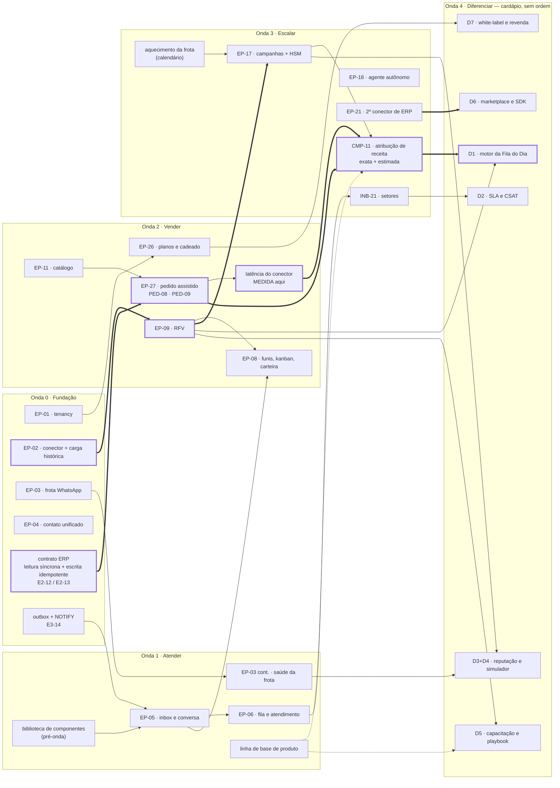

# GeraCRM — Plano macro das Ondas 1 a 4

> Deriva de [`backlog-epicos-geracrm.md`](./backlog-epicos-geracrm.md) §3–§4,
> [`escopo-funcional-geracrm.md`](./escopo-funcional-geracrm.md) §19,
> [`plano-onda-0.md`](./plano-onda-0.md), [`decisoes.md`](./decisoes.md),
> [`especificacao-telas.md`](./especificacao-telas.md) §8–§9 e
> [`prontidao-para-inicio.md`](./prontidao-para-inicio.md) §4–§5.
>
> Preenche a lacuna registrada em `prontidao-para-inicio` §5: as Ondas 1–4 tinham backlog (*o quê*)
> e nenhum plano (*como, em que ordem, com que critério*).

---

## 0. O que este documento é — e o que ele deliberadamente não é

**É macro.** Para cada onda: objetivo, sequência de épicos com o que bloqueia o quê, marcos,
critério de saída **observável**, dependências externas, riscos e a lista fechada do que não entra.

**Não é o plano de execução.** Não há tarefa com dono, definição de pronto por item, sequência
semanal nem migration numerada — isso é o formato do `plano-onda-0.md`, e ele se escreve **ao entrar
na onda**, não antes.

⚠️ **Detalhar a Onda 3 hoje é planejar o que vai mudar.** A Onda 2 vai descobrir a latência real do
conector, o volume real de mídia, o que a vendedora ignora na tela e o que o gestor abre todo dia.
Cada uma dessas descobertas reescreve tarefa da onda seguinte. O que **não** muda com a descoberta —
a ordem das dependências, o critério de saída, a fronteira do escopo — é o que está aqui.

### 0.1 Ritual de abertura de onda

Nenhuma onda começa sem estes cinco artefatos escritos. É o mesmo pacote que a Onda 0 teve.

| # | Artefato | Formato de referência | Por que antes, e não durante |
|---|---|---|---|
| 1 | **Plano de execução da onda** | `plano-onda-0.md` — caminho crítico externo, tarefas por épico com dep. e DoD, sequência semanal, riscos, o que não entra, checklist de fechamento | Sem DoD escrito, agente de IA entrega o que **parece** pronto e ninguém tem com o que discordar (`prontidao` §4.2) |
| 2 | **Cenários BDD da onda** | `cenarios-bdd.md` (Ondas 0–1 já feitas) | Regra ambígua descoberta na implementação custa o dobro |
| 3 | **Especificação das telas da onda** | `especificacao-telas.md` §0 — os cinco estados, transições, web × mobile | A lista das telas pendentes por onda está em `especificacao-telas.md` §9 |
| 4 | **Fechamento das decisões que a onda cobra** | ADR em `decisoes.md` | §7.3 lista qual decisão cada onda cobra |
| 5 | **Linha de base + alvo de produto** | — | ⚠️ Lacuna `prontidao` §4.3. Métrica decidida depois é métrica sem histórico, e o produto que promete provar ROI não pode ser o único sem "antes" |

E, ao **fechar** a onda: rodar de novo a revisão de consistência cruzada
(`revisao-consistencia.md`) sobre os documentos que a onda alterou.

### 0.2 Duração — estimativa, não compromisso

| Onda | Estimativa | O que domina o prazo |
|---|---|---|
| **1 — Atender** | 8 semanas + 2 de virada | Front (é a primeira onda de tela) e a adoção humana, que não paraleliza |
| **2A — Vendável** | 10–12 semanas | Pedido assistido + RFV; é o caminho crítico do produto inteiro |
| **2B — Completo** | 6–8 semanas | Pode escorregar para dentro da Onda 3 sem quebrar a cobrança (§4.8) |
| **3 — Escalar** | 12–16 semanas | Aprovação de template e **aquecimento de número** — tempo de calendário de terceiro |
| **4 — Diferenciar** | contínuo, 3–5 semanas por diferencial | Não tem fim; tem cardápio (§6) |

---

## 1. As quatro ondas em uma tela

| Onda | Objetivo em uma frase | A pergunta que responde | Critério de saída, em uma linha |
|---|---|---|---|
| **1 · Atender** | A equipe larga a ferramenta atual e atende pelo GeraCRM | *Dá para trabalhar aqui oito horas por dia sem voltar para o WhatsApp Web?* | Nenhuma mensagem faturada na Meta sem linha correspondente no nosso banco, por 10 dias úteis |
| **2 · Vender** | A vendedora sabe com quem falar, o que dizer, e fecha o pedido sem sair da conversa | *Isto vale uma assinatura mensal?* | **Contrato assinado e primeira fatura paga** — e ≥ 30% dos pedidos do cliente entrando pelo GeraCRM |
| **3 · Escalar** | Campanha com ROI medido, IA qualificando sozinha, pedido em campo | *O produto prova que se paga?* | O cliente responde sozinho "quanto a campanha X me deu de volta", e o número confere contra o ERP dele |
| **4 · Diferenciar** | Transformar em produto o que hoje é promessa de venda | *Por que este e não o concorrente de R$ 297?* | ⚠️ Não tem critério de onda — tem critério **por diferencial** (§6.4) |

**Ondas 0–2 = produto vendável. Onda 3 = produto competitivo. Onda 4 = produto sem paralelo.**

---

## 2. ⚠️ As dependências que não podem ser invertidas

Cada linha é uma cadeia onde o elo posterior **não funciona** se o anterior não estiver de pé — e
onde inverter não é "mais lento", é retrabalho ou promessa falsa.

| # | Cadeia | Nasce → cobra | O que acontece se inverter |
|---|---|---|---|
| **1** | carga histórica → **RFV** → segmentação → campanha | 0 → 2 → 2 → 3 | A matriz nasce vazia e a campanha vira disparo para "todos" — exatamente o que os concorrentes baratos fazem. É o argumento central do produto morrendo |
| **2** | **latência do conector** → atribuição de receita | 0 *(contrato)* → 2 *(medida)* → 3 *(cobrada)* | ⚠️ Se a venda efetivada só volta como `venda` dias depois, "receita em 3 dias" é número errado. **A Onda 2 é a última chance de medir** — na 3 já foi prometido |
| **3** | leitura síncrona + escrita idempotente → **pedido assistido** | 0 *(contrato E2-12/E2-13)* → 2 *(uso)* | Renegociar o contrato de integração com a Onda 2 já começada. É a dependência nº 4 do backlog, e por isso ela entrou na Onda 0 sem tela |
| **4** | vínculo **PED-09** → atribuição *exata* | 2 → 3 | Sobra só a atribuição estimada por janela — que é a que todo mundo já tem. As duas fontes nunca são somadas (CMP-11) |
| **5** | **biblioteca de componentes** → qualquer tela | pré-1 → 1, 2, 3 | Token sem componente não constrói tela. Cada tela inventa a sua, e a Onda 2 refaz as três da Onda 1 |
| **6** | inbox → fila/atendimento → setores → **SLA, CSAT** | 1 → 1 → 3 → 4 | SLA sobre fila que não existe. `atendimento` já nasce completo na Onda 0 exatamente para isso |
| **7** | **planos e limites (PLT-06)** → cobrar | 2 → 2 | Vende-se sem conseguir limitar o que foi vendido. A resposta da API precisa distinguir *sem permissão* de *não contratado* desde já |
| **8** | **aquecimento da frota** → campanha em volume | 2 *(começa)* → 3 *(usa)* | ⚠️ Número novo começa em tier baixo e sobe por qualidade **ao longo de semanas**. Aquecimento é calendário, não configuração — e não paraleliza. Se a campanha é a promessa da Onda 3, o aquecimento começa na 2 |
| **9** | **linha de base de produto** → prova de ROI | 0/1 → 3/4 | Sem "antes", não existe "depois". BI-11 ("este mês o GeraCRM gerou R$ X") não tem denominador |
| **10** | 2+ conectores reais em produção → **SDK / marketplace** | 3 → 4 | SDK que espelha o único ERP que existe. A suíte de conformidade da Onda 0 só provou o que ela mesma imaginou |

⚠️ **As cadeias 2 e 8 são as que mais escapam**, porque nenhuma delas se manifesta como card no
board: uma é um número que ninguém mediu, a outra é tempo de calendário que ninguém reservou.

---

## 3. Onda 1 — Atender

> **Objetivo:** a equipe larga a ferramenta atual e passa a atender pelo GeraCRM.
> **Pergunta que responde:** *dá para trabalhar aqui oito horas por dia sem voltar para o WhatsApp Web?*

⚠️ **É a primeira onda com usuário real.** O trabalho de migração (treinar, conviver, decidir a
virada, ter critério de rollback) **é escopo da onda**, não overhead — é a lacuna `prontidao` §4.1
chegando à conta.

⚠️ **É a primeira onda de front.** O back que ela consome já existe desde a Onda 0: ingestão de
mensagem (E3-06), envio com todas as revalidações (E3-09), janela derivada (E3-10), outbox e
`NOTIFY` (E3-14). O gargalo da Onda 1 **não é domínio** — é biblioteca de componentes, SSE no
console e adoção humana.

### 3.1 Épicos, ordem e bloqueios

| Ordem | Épico | Entrega | Bloqueado por | Bloqueia |
|---|---|---|---|---|
| **0** | *(pré-onda)* **Biblioteca de componentes** | Tokens (ADR-012) virando componente Angular + preset Expo; os cinco estados de `especificacao-telas` §0.1 | — | **tudo** |
| **1** | **EP-05** — Inbox e conversa | INB-01…08, INB-11 | pré-onda, E3-14 | EP-06, EP-04 cont. |
| **2** | **EP-06** — Fila e assunção | INB-09, INB-10 | EP-05 | Onda 3 (setores), Onda 4 (SLA/CSAT) |
| **A** | **EP-03 cont.** — Saúde da frota | CAN-04 (tier, pagamento, LIVE, verificada, qualidade), CAN-05 | E3-13 | Onda 3 (governança de reputação) |
| **B** | **EP-04 cont.** — Superfície do contato | CTT-05…08, CTT-10 | EP-05 *(coluna C)* | Onda 2 (kanban, campos no card) |
| **C** | **EP-07** — Governança | PLT-05 auditoria, PLT-07 notificações e push | — | — |
| **D** | **EP-02 cont.** — Superfície de integração | INT-06 docs, INT-07 webhooks de saída, INT-08 painel de sync, INT-09 CSV | — | — |

**1 → 2 é a única sequência dura.** A, B, C e D são raias paralelas com donos diferentes: A e D não
tocam tela de conversa; C é transversal; B só depende do inbox para a coluna de contexto.

⚠️ **Dentro do EP-05, a ordem que importa:** shell do console → **SSE como Observable** (ADR-010 §4)
→ lista de conversas → conversa → composer com bloqueio de janela. O SSE vem **antes** da lista, não
depois: montar a lista com fetch e "ligar o tempo real depois" é reescrever o estado da tela.

### 3.2 Marcos verificáveis

| # | Marco | Como se constata |
|---|---|---|
| **M1.1** | Primeira tela real | Shell do console com navegação, tokens aplicados e os cinco estados; login (herdado da Onda 0) levando a ela |
| **M1.2** | **Tempo real de ponta a ponta** | Mensagem entra pelo webhook e aparece na tela sem refresh — **e a suíte de isolamento de canal SSE prova que só o tenant certo recebeu** |
| **M1.3** | Conversa completa | Texto, mídia, áudio com player, **anel de janela** drenando (ADR-012), bloqueio fora da janela oferecendo template |
| **M1.4** | Operação | Fila pull com "Assumir atendimento", abas Meus/Fila com contador, protocolo numerado, busca por nome/telefone/protocolo |
| **M1.5** | Frota visível | Painel de saúde com tier, qualidade e **`pagamento OK`** — a falha por método de pagamento ausente aparece com essa causa, não como "erro ao enviar" (ADR-002) |
| **M1.6** | **Piloto sombra** | 2 vendedoras usando o GeraCRM em paralelo à ferramenta antiga por 1 semana, com lista aberta de "o que a antiga faz e a nossa não" |
| **M1.7** | **Virada** | Operação inteira sem a ferramenta antiga |

### 3.3 ✅ Critério de saída observável

Não é "o inbox está pronto". São fatos constatáveis:

| # | Critério | Onde se verifica |
|---|---|---|
| **1** | Por **10 dias úteis consecutivos**, não existe mensagem faturada no painel da Meta sem linha correspondente em `mensagem` | Conciliação painel Meta × nosso banco. ⚠️ Divergência = alguém está usando o WhatsApp Web. É o critério que não aceita opinião |
| **2** | A ferramenta antiga teve **acesso revogado ou contrato cancelado** | Fato administrativo, com data |
| **3** | **Zero conversa órfã**: toda conversa com mensagem entrante no período tem `atendimento` com dono ou está visível na fila | Consulta ao banco no fechamento |
| **4** | **Zero evento entregue a tenant errado** e suíte de isolamento de canal verde | `geracrm-tempo-real` + log do período |
| **5** | **Linha de base de produto capturada**: tempo até primeira resposta, mensagens/dia por número, conversas/dia, % sem resposta | É o "antes" que as Ondas 3 e 4 vão usar para provar ROI (cadeia nº 9) |

### 3.4 Dependências externas

| Dono | Item | ⚠️ |
|---|---|---|
| **Meta** | M-05 (Tech Provider) e M-07 (App Review) **aprovados** | ⚠️ A Onda 1 é a primeira que **exige número de cliente real**. Se a Onda 0 fechou com números da Gera3 (plano B da §1.4 do `plano-onda-0`), a Onda 1 não fecha. O passivo da Meta é cobrado aqui |
| **Cliente** | Disponibilidade das vendedoras para treinamento; decisão de cancelar a ferramenta antiga | A decisão é do dono, não nossa. Sem data marcada, o piloto sombra vira permanente |
| **Jurídico** | Política de privacidade e termos publicados; base legal do tratamento de conversa | Também é requisito do App Review (URL de política) |
| **ERP** | Nada novo | O conector já rodou na Onda 0 |

### 3.5 Riscos

| # | Risco | Sinal antecipado | Mitigação |
|---|---|---|---|
| **1** | ⚠️ **Rejeição das vendedoras.** É o risco nº 1 da onda e não é técnico | Vendedora com o WhatsApp Web aberto na 2ª semana do piloto | Piloto sombra (M1.6) com 2 pessoas escolhidas — nem as mais resistentes, nem as mais entusiastas; **critério de rollback escrito antes da virada**; lista de lacunas mantida aberta e respondida item a item |
| **2** | **Biblioteca de componentes subestimada** | Card de "componente novo" na semana 4 | Começar **antes** da onda (`prontidao` §5); inventário limitado ao que as telas da Onda 1 usam. Componente sob demanda, não catálogo |
| **3** | **SSE em rede real** — reconexão, multi-aba, proxy que bufferiza | Usuário relatando "sumiu e voltou" | Cursor de versão desde o 1º dia; teste de reconexão com queda forçada; o **payload mínimo** (ADR-007) faz o pior caso ser um refetch, nunca um vazamento |
| **4** | **Volume de mídia** — áudio de WhatsApp em operação real acumula rápido | Curva do bucket na semana 1 do piloto | Política de ciclo de vida já configurada na Onda 0 (I-05); medir e projetar durante o piloto, não depois |
| **5** | **Janela de 24h errada** = mensagem não enviada, ou custo em dobro | Reclamação de "não deixou responder" | Função pura em `shared` com testes de fronteira em 23h/24h (E3-10, já feita); o anel nunca é a única fonte — o texto permanece (ADR-012) |
| **6** | ⚠️ **"Já que estamos aqui, coloca o kanban"** — o gestor vê tela pela primeira vez e pede a Onda 2 | Card de CRM/RFV no board | §3.6 é lista fechada. Pedido vira card da Onda 2 **com data**, na frente do gestor |

### 3.6 O que **NÃO** entra na Onda 1

> Lista fechada. Card fora dela precisa de justificativa escrita e de um item removido em troca.

| Não entra | Onda | Por quê |
|---|---|---|
| Kanban, funis, carteira **na tela** (CRM-01…09) | 2 | `carteira_atribuicao` já é escrita por caso de uso desde a Onda 0 |
| **RFV** e ciclo de vida (RFV-01…06) | 2 | Sem o funil, a matriz não tem onde aparecer — e classificar sem o gestor validar as faixas é jogar o trabalho fora |
| Pedido assistido, catálogo, copiloto, campanhas | 2–3 | — |
| **Setores, distribuição automática, SLA, CSAT** (INB-21…24) | 3–4 | ⚠️ A fila é **pull** por decisão, não por limitação. Distribuição automática antes de existir setor é roteamento para lugar nenhum |
| Respostas rápidas, notas, transferência, colisão (INB-12…18) | 2 | ⚠️ Tentação alta porque "é pequeno". Transferência sem setor é meia funcionalidade; colisão precisa de presence declarado (ADR-007, heartbeat) |
| App mobile (MOB-*) | 2 | Na Onda 1 a vendedora atende no desktop |
| Instagram (CAN-07) | 2–3 | A permissão foi pedida junto no App Review; `perfil_instagram` segue vazia |
| BI, metas, ranking | 2 | — |
| Changelog in-app (PLT-08), suporte embutido (PLT-11) | 2 | ⚠️ **Divergência aberta (M-10 da revisão):** PLT-11 é Onda 2 no escopo e entregável da Onda 1 no backlog. Resolver na abertura da onda — recomendação: **Onda 2**, junto do resto da superfície de plataforma |

⚠️ **Divergência a resolver na abertura:** **RFV-08 (qualidade cadastral)** é Onda 3 no escopo
funcional e Onda 1 na mitigação do risco nº 1 do backlog. Recomendação: **Onda 1**, porque durante a
virada ela é ferramenta de higienização (40% da base sem CPF/CNPJ na referência), não relatório.

---

## 4. Onda 2 — Vender

> **Objetivo:** a vendedora sabe com quem falar, o que dizer, e fecha o pedido sem sair da conversa;
> o gestor vê meta, ranking e receita.
> **Pergunta que responde:** *isto vale uma assinatura mensal por número?*

⚠️ **É a onda mais pesada do produto** — treze épicos — **e a onda em que o produto passa a ser
cobrável.** Os dois fatos juntos criam o risco central: uma onda que nunca fecha impede a cobrança
indefinidamente. A resposta está em §4.8 (partição 2A/2B).

### 4.1 Épicos, ordem e bloqueios — três trilhos

**Trilho A — analítico (caminho crítico do produto)**

```
carga histórica (Onda 0) → EP-09 RFV → EP-08 funis/kanban/carteira → EP-10 tarefas
                                    ↘ EP-13 metas e ranking → EP-14 home executiva
```

⚠️ **EP-09 vem antes de EP-08, e a ordem é obrigatória.** O card do kanban (CRM-03) exibe o badge
RFV, e a coluna do Funil de Relacionamento é **derivada da quantidade de pedidos** — por isso ela não
é arrastável (achado B-04 da revisão). Kanban antes do RFV entrega o card sem o dado que o justifica.

**Trilho B — transacional (o que fecha a venda)**

```
EP-11 catálogo espelhado → EP-27 pedido assistido → PED-09 vínculo pedido↔conversa↔campanha↔tarefa
        ↑                          ↑
  ingestão (Onda 0)      E2-12 leitura síncrona + E2-13 escrita idempotente (Onda 0)
```

⚠️ **Se E2-12 e E2-13 não estiverem de pé, o Trilho B não começa.** É a dependência nº 3 da §2, e é
a razão de elas terem entrado na Onda 0 sem tela nenhuma.

**Trilho C — superfície e plataforma**

| Épico | Depende de | Observação |
|---|---|---|
| **EP-26** (PLT-06 planos, limites, cadeado) | EP-01 | ⚠️ **Pré-requisito de cobrar**, não item de produto. Precisa estar de pé **antes do primeiro contrato** |
| **EP-16** produtividade do inbox (INB-12…18) | EP-05 (1), **EP-08** para INB-12 | Presence (INB-18) por heartbeat, ADR-007 |
| **EP-12** copiloto de IA (IA-01…04) | **EP-09** | ⚠️ Copiloto sem contexto de RFV, cidade e categorias compradas é ChatGPT com botão. Depende do trilho A |
| **EP-15** app mobile (MOB-01…07) | trilhos A e B com API estável | ⚠️ Começar cedo demais é refazer. O app é **recorte** (5 tabs), não espelho |
| **EP-19** início — app do vendedor com carteira | EP-15 | — |
| **EP-20** início — Instagram Direct no inbox | EP-05 (1) | Independente e barato. ⚠️ Primeiro candidato a sair se a onda apertar |

### 4.2 Marcos verificáveis

| # | Marco | Como se constata |
|---|---|---|
| **M2.1** | **RFV vivo** | 100% da base classificada **ou explicitamente não classificável** por cobertura (INV-56/E2-09). O gestor valida as faixas **antes** de virarem tela |
| **M2.2** | **Kanban com a base real** | Coluna de 11 mil cards paginada por coluna, com drag-drop — prova a decisão nº 5 do ADR-010 fora do seed |
| **M2.3** | Catálogo utilizável | Busca por referência/SKU, seleção por grade cor × tamanho, tabela de preço do cliente aplicada |
| **M2.4** | **Primeiro pedido efetivado** | Montado na conversa, enviado ao ERP, número do pedido de volta |
| **M2.5** | ⚠️ **Primeiro pedido que FALHA e é recuperado** | Estoque esgotado / crédito bloqueado / item inativo → erro **tipificado**, ação corretiva na tela, **rascunho intacto** (PED-08). **Este é o marco — não o M2.4.** O caminho feliz não prova nada |
| **M2.6** | **Latência do conector medida e publicada** | Tempo entre efetivação no ERP e a venda aparecer ingerida. ⚠️ Cadeia nº 2 da §2 — é aqui, e só aqui, que esse número pode ser levantado a tempo |
| **M2.7** | Home executiva conferida | O gestor compara com o relatório dele no mesmo período. Divergência é **bug**, não "critério de apuração" |
| **M2.8** | App no aparelho | Instalado na vendedora, com push chegando |
| **M2.9** | **Cadeado provado** | Tenant em plano inferior recebe *não contratado* — distinto de *sem permissão* e de *capacidade ausente do ERP* |

### 4.3 ✅ Critério de saída observável

| # | Critério | Onde se verifica |
|---|---|---|
| **1** | ⚠️ **Contrato assinado e primeira fatura paga** | Não é "o produto está vendável" — é *o produto foi vendido*. Critério comercial de propósito: é o único que prova a onda |
| **2** | Em **4 semanas consecutivas**, ≥ **30%** das vendas do cliente têm origem no GeraCRM | Vendas com origem GeraCRM ÷ total de vendas no período **no ERP**. ⚠️ Medido contra o ERP, nunca contra o nosso banco. O piso exato é acordado na abertura da onda — a operação tem canais fora da conversa (balcão, feira, representante) |
| **3** | Vendedora concluiu ≥ 1 tarefa por dia útil em ≥ 80% dos dias | Prova que virou rotina, não repositório. Proxy mais forte, se houver telemetria: **qual tela ela abre primeiro no dia** |
| **4** | **Zero rascunho perdido** por falha de efetivação no período | Contagem direta. Se houver um, PED-08 não está pronto |
| **5** | **Latência do conector publicada**, com o efeito declarado sobre a janela de atribuição | ⚠️ Se passar de 24h, "receita em 3 dias" perde sentido e a Onda 3 precisa saber **agora** |

### 4.4 ⚠️ O que exatamente precisa estar de pé para cobrar

Cobrar não é uma funcionalidade — é um conjunto de pré-requisitos de quatro naturezas, e três deles
**não estão em épico nenhum**.

| Natureza | Item | Onde está | ⚠️ |
|---|---|---|---|
| **Produto** | RFV classificando a base, com cobertura declarada | EP-09 · 2A | É o que diferencia de caixa de entrada |
| **Produto** | Kanban de relacionamento + carteira na tela | EP-08 · 2A | É a rotina do gestor |
| **Produto** | Catálogo com grade e preço do cliente | EP-11 · 2A | Pré-requisito do pedido |
| **Produto** | Pedido assistido efetivando no ERP, **com PED-08** | EP-27 · 2A | É o que substitui o sistema atual. Sem PED-08 a vendedora volta a lançar no ERP |
| **Produto** | Tarefas com conclusão registrada | EP-10 · 2A | Fecha o ciclo decidir → agir → registrar |
| **Comercial** | **Preço e unidade de cobrança definidos** | ⚠️ **Fora do backlog** | A recomendação (por número de WhatsApp) em `concorrentes-tailor` §9 é recomendação, não decisão. Muda **o que PLT-06 mede** — número, usuário, volume ou filial |
| **Comercial** | Planos, limites e cadeado distinguindo *não contratado* | EP-26 (PLT-06) · 2A | Vender sem conseguir limitar é entregar tudo |
| **Comercial** | **Faturamento e cobrança** — quem emite a nota, como cobra, o que acontece na inadimplência | 🔴 **Não existe ID no escopo** | Lacuna real: PLT-06 cobre limite e cadeado, **não** cobrança. Precisa de decisão (ferramenta externa vs. módulo) na abertura da onda |
| **Jurídico** | Contrato, termos de uso, política de privacidade, **DPA** com Meta / AWS / provedor de IA, LGPD | ⚠️ `prontidao` §5 | Sem isso não se assina |
| **Operacional** | **Onboarding de tenant executável pelo cliente**, sem nós | EP-01/E1-07 + `especificacao-telas-entrada` | ⚠️ Hoje o fluxo pressupõe que somos nós que conectamos Meta e ERP. Cobrar do segundo cliente exige que ele entre sozinho |
| **Operacional** | Runbook, canal de suporte, nosso SLA | ⚠️ `prontidao` §5 | — |
| **Operacional** | Linha de base capturada na Onda 1 | §3.3 critério 5 | É a prova de ROI que a venda usa |

### 4.5 Dependências externas

| Dono | Item | ⚠️ |
|---|---|---|
| **Comercial** | Preço e unidade de cobrança | ⚠️ **Bloqueia PLT-06**, não só o contrato |
| **Jurídico** | Contrato, termos, DPA, LGPD | Prazo de terceiro |
| **ERP** | `escritaPedido` disponível **em produção**, com idempotência honrada e número de pedido de retorno | ⚠️ Se o ERP não tiver a capacidade, o produto **degrada** para rascunho exportável (ADR-008) — o critério nº 2 muda de forma, não desaparece |
| **Provedor de IA** | Conta, teto de custo, latência de transcrição | Decisão aberta nº 6 da stack: define se EP-12 é Onda 2 ou 3 |
| **Apple / Google** | Conta de desenvolvedor e publicação do app | ⚠️ Review de loja é prazo de terceiro. Distribuição interna (EAS) resolve o piloto, não o cliente. Abrir na semana 1 da onda |
| **Meta** | Nada novo — **exceto o aquecimento da frota**, que começa aqui | Cadeia nº 8 da §2 |
| **Cliente** | Validação das faixas de RFV e do ciclo de vida em dias | Faixa padrão do perfil de vertical é ponto de partida, não resposta |

### 4.6 Riscos

| # | Risco | Sinal antecipado | Mitigação |
|---|---|---|---|
| **1** | ⚠️ **Treze épicos — a onda não fecha nunca** | Semana 10 sem M2.4 | **Partição 2A/2B (§4.8).** O critério de saída é o de 2A |
| **2** | **PED-08** — o item mais subestimado do escopo | Efetivação sempre testada no caminho feliz | É **marco** (M2.5), não critério de aceite escondido. Erros do ERP já vêm tipificados do contrato da Onda 0 (E2-13) |
| **3** | ⚠️ **RFV nascendo errado** por cobertura menor que a suposta | Segmento "Perdido" grande demais no primeiro carregamento | E2-09 já bloqueia: fora da cobertura, **não classifica**. O risco real é o gestor ler "Perdido" onde é "não sabemos" e perder a confiança na ferramenta inteira no primeiro contato |
| **4** | ⚠️ **Latência do conector** inviabilizando a atribuição da Onda 3 | M2.6 sem número até a semana 8 | Instrumentar desde o primeiro pedido; publicar. Se > 24h, a janela de 3 dias é renegociada **na Onda 2**, não na 3 |
| **5** | **Kanban com 11 mil cards** | Tempo de abertura da coluna com base real | Paginação por coluna (ADR-010 §5), medida com a base do cliente, não com seed |
| **6** | **Custo de IA sem teto** | Primeira fatura do provedor | Teto por tenant e por mês; o copiloto **degrada para "sem sugestão"** em vez de estourar — mesma disciplina do ADR-008 |
| **7** | **App virando espelho do web** | Card de tela que não está nas 5 tabs | MOB é recorte. O que não está nas 5 tabs não entra |
| **8** | **Onboarding só funciona com a gente junto** | Segundo cliente exigindo call de setup | Tratar o onboarding self-service como entregável de 2A, não como documentação |

### 4.7 O que **NÃO** entra na Onda 2

| Não entra | Onda | Por quê |
|---|---|---|
| **Campanhas, templates HSM, disparo** (CMP-*) | 3 | ⚠️ É a pergunta mais frequente na demo. A resposta é: campanha sem segmentação **validada em uso** é disparo para "todos" com mais passos |
| **Relatório de atribuição de receita** (CMP-11, BI-02) | 3 | O **vínculo** (PED-09) nasce agora; o relatório, não |
| Agente autônomo de IA (IA-05…09) | 3 | O copiloto (IA-01…04) é o que entra |
| Setores, SLA, CSAT, monitoramento ao vivo | 3–4 | — |
| **Fila do Dia** (TSK-07) e seu motor (TSK-08) | 3 / 4 | Tarefas manuais primeiro. Priorizar sem histórico de resultado é chutar com interface bonita |
| Offline (PED-14), link de pagamento (PED-12), status do pedido (PED-13), desconto com alçada (PED-15), repetir compra (PED-16) | 3 | — |
| Visão de Mercado, distribuição RFV da base, mapa (RFV-07/09/12) | 3 | — |
| Conectores além do GeraCloud (INT-10) | 3 | — |
| White-label, revenda, marketplace (PLT-09/10, INT-13) | 4 | `tenant.tenant_pai_id` já existe, vazio |
| Predição de churn, valor esperado de reativação (RFV-10/11) | 4 | Alimentam D1; exigem histórico de resultado de toque, que só passa a existir na Onda 3 |

### 4.8 ⚠️ A partição 2A / 2B — como a onda fecha

| Bloco | Épicos | O que torna verdadeiro |
|---|---|---|
| **2A — cobrável** | EP-09, EP-08, EP-11, **EP-27**, EP-26, EP-10 (mínimo: tarefa, abas, conclusão) | Os critérios de saída §4.3 e os pré-requisitos §4.4 |
| **2B — completo** | EP-12, EP-13, EP-14, EP-15, EP-16, EP-19, EP-20 | Torna o produto bom; **não** decide se ele é cobrável |

**Regra:** 2B pode escorregar para dentro da Onda 3 **sem quebrar a cobrança** — desde que o
escorregamento seja **declarado na abertura da Onda 3, com as datas refeitas**. O que não pode
acontecer é a Onda 3 começar e alguém descobrir na semana 6 que a Onda 2 nunca fechou.

⚠️ Se 2B escorrega inteiro, reavaliar: sem EP-14 (home executiva) o **gestor** não tem tela — e é ele
quem assina o contrato. Home executiva é o item de 2B com maior chance de precisar subir para 2A.

---

## 5. Onda 3 — Escalar

> **Objetivo:** campanha com ROI medido, IA qualificando sozinha, representante tirando pedido em campo.
> **Pergunta que responde:** *o produto prova que se paga?*

⚠️ **É a onda que entrega a promessa central do produto** — receita atribuída a campanha, tarefa e
IA. Tudo o que a torna possível foi decidido em ondas anteriores; a Onda 3 só colhe.

### 5.1 Épicos, ordem e bloqueios — quatro trilhos independentes

**Trilho 1 — campanhas (caminho crítico da onda)**

```
CMP-03 templates HSM ─(aprovação Meta: prazo de terceiro)─┐
CMP-01/02 público e variáveis ────────────────────────────┤
                                                          ▼
                          CMP-07 fila (throttling E3-11, Onda 0)
                                                          ▼
                          CMP-08 disparo distribuído + CMP-09 anti-ban
                                                          ▼
                          CMP-10 relatório → CMP-11 ATRIBUIÇÃO → CMP-12 custo e ROI
```

⚠️ **CMP-11 é o fim da cadeia, não o começo.** Depende de PED-09 (Onda 2), da latência medida
(Onda 2) e da segmentação RFV **em uso há semanas** (Onda 2). Nenhuma das três se resolve aqui.

⚠️ **EP-24 entra parcial e cedo** (CAN-06, bloqueio automático de número em risco): proteger a frota
é **pré-requisito de disparar**, não diferencial. O resto do EP-24 (saúde preditiva, simulador) fica
na Onda 4.

**Trilho 2 — agente autônomo (EP-18).** Depende da base de conhecimento do cliente e do handoff, que
usa a fila da Onda 1. Independente do trilho 1 — dono próprio, corre em paralelo.

**Trilho 3 — pedido em campo (EP-27 cont.).** PED-12 pagamento, PED-13 status, PED-14 offline,
PED-15 alçada, PED-16 repetir. Depende só do pedido da Onda 2.

**Trilho 4 — ecossistema (EP-21 + EP-09 cont. + EP-14 cont. + EP-16 cont. + EP-20).**
⚠️ **O segundo conector de ERP é o teste real do ADR-008.** A suíte de conformidade da Onda 0 só
provou o que ela mesma imaginou; é o segundo ERP real que diz se a porta foi definida pelo domínio ou
copiada do GeraCloud. **Recomendação: o drezz como segundo** — mesma casa, feedback em horas — antes
de Bling/Tiny.

### 5.2 Marcos verificáveis

| # | Marco | Como se constata |
|---|---|---|
| **M3.1** | Primeiro **template HSM aprovado pelo nosso fluxo** | Submissão e acompanhamento pela API, não pelo Business Manager |
| **M3.2** | Primeira campanha real por segmento RFV | Custo previsto × custo realizado dentro de ±10% |
| **M3.3** | ⚠️ **Primeira campanha com receita atribuída** | As **duas fontes exibidas separadas** — exata (PED-09) e estimada (janela 3/7/14d) — e a soma delas nunca aparece (CMP-11) |
| **M3.4** | Frota protegida sozinha | Número pausado automaticamente por queda de qualidade **antes** de a Meta agir |
| **M3.5** | Primeiro lead qualificado pela IA sem toque humano | Com tempo até qualificação medido e motivo registrado (IA-07, IA-09) |
| **M3.6** | Segundo ERP em produção | Mesma suíte de conformidade, `skip` declarados, **degradação visível na tela** |
| **M3.7** | Pedido offline efetivado ao reconectar | Conflito de saldo **apresentado**, não resolvido sozinho (ADR-009) |

### 5.3 ✅ Critério de saída observável

| # | Critério | Onde se verifica |
|---|---|---|
| **1** | ⚠️ **O cliente responde sozinho "quanto a campanha X me deu de volta"**, e o número confere contra o ERP dele | Se depender de nós exportarmos planilha, a onda **não fechou** |
| **2** | ≥ **3 campanhas disparadas pelo próprio cliente**, sem nossa participação na operação | Com custo previsto × realizado dentro da margem declarada |
| **3** | A IA qualificou leads com **taxa de erro auditada**, e existe painel onde o gestor **discorda** de uma qualificação | O produto tem de aceitar estar errado (IA-09) |
| **4** | **Nenhum número bloqueado pela Meta no período** | É o critério honesto de anti-ban: não é "temos anti-ban", é "a frota sobreviveu" |
| **5** | **Segundo ERP em produção em ao menos um tenant** | Prova o ADR-008 fora do papel |

### 5.4 Dependências externas

| Dono | Item | ⚠️ |
|---|---|---|
| **Meta** | Aprovação de templates (dias, com rejeição possível) | Submeter os 5 mais usados **na Onda 2**, antes de precisar |
| **Meta** | **Tier do número** — começa em 250/dia e sobe por qualidade | ⚠️ Cadeia nº 8 da §2: aquecimento é **semanas de calendário** e não paraleliza |
| **Meta** | Reavaliação Solution Partner × Tech Provider | ADR-002 marcou a reavaliação **para esta onda**. Muda receita e risco de crédito — decisão comercial com ADR próprio |
| **Cliente** | **Base de conhecimento da IA** — texto sobre a marca, política de preço, FAQ | ⚠️ É trabalho do cliente, e cliente sempre atrasa. Pedir na abertura da onda |
| **Cliente** | **Opt-in** da base para disparo | Disparar para base histórica sem consentimento é risco jurídico e de reputação ao mesmo tempo |
| **Jurídico** | LGPD operacional (CTT-15): consentimento, exportação, exclusão do titular | Vira obrigatório quando existe disparo em massa |
| **Gateway de pagamento** | Conta e homologação (INT-12) para PED-12 | — |
| **ERP nº 2** | Documentação, credenciais de homologação, base de teste | Mesmo pacote M-09…M-11 da Onda 0, com outro dono |

### 5.5 Riscos

| # | Risco | Sinal antecipado | Mitigação |
|---|---|---|---|
| **1** | ⚠️ **A atribuição sai errada e o produto perde o argumento central** | Divergência entre receita atribuída e o relatório do ERP | Duas fontes separadas (CMP-11), janela declarada, e a **latência medida na Onda 2 publicada junto do relatório**. ROI que não diz de onde veio é pior que nenhum |
| **2** | **Rejeição de template** trava a campanha | Primeira submissão reprovada | Submeter cedo (Onda 2); biblioteca reutilizável; **motivo da rejeição exibido**, não "erro" |
| **3** | ⚠️ **Ban de número** — é o ativo mais caro do cliente | Queda de qualidade no painel (CAN-04, Onda 1) | Anti-ban (CMP-09) + governança preditiva (CAN-06, antecipada) + **limite diário conservador por padrão**, afrouxado só por qualidade medida |
| **4** | **Custo da campanha surpreende o cliente** | Primeira fatura da Meta | Aviso no clique (CMP-05) precisa ser **bom**, porque o simulador (CMP-18) é Onda 4 |
| **5** | **IA alucinando com cliente real** | Handoff acontecendo tarde demais | Base de conhecimento fechada; handoff por incerteza; painel de auditoria (IA-09). ⚠️ O agente **nunca** fecha pedido nem promete prazo |
| **6** | **Débito da 2B sufocando a onda** | Épico da Onda 2 aberto na semana 4 | Escorregamento é **declarado na abertura**, com datas refeitas (§4.8) |
| **7** | ⚠️ **Reabrir o canal não oficial** porque ADR-003 diz "reavaliar na Onda 3" | Card de Baileys no board | **Reavaliar ≠ construir.** Recomendação: não reabrir. Se reabrir, é módulo isolado com infraestrutura própria, nunca no caminho principal |

### 5.6 O que **NÃO** entra na Onda 3

| Não entra | Onda | Por quê |
|---|---|---|
| Simulador pré-disparo (CMP-18) | 4 | O aviso de custo (CMP-05) cobre a Onda 3 |
| Predição de churn (RFV-10), valor esperado (RFV-11), **motor da Fila do Dia** (TSK-08) | 4 | Precisam do histórico de **resultado de toque**, que só começa a existir agora |
| SLA, CSAT, monitoramento ao vivo (INB-22…24) | 4 | Setores (INB-21) entram agora; o resto depende de operá-los |
| Capacitação, playbook, comissionamento, gamificação (GES-06…10) | 4 | — |
| White-label, revenda, marketplace, SDK (PLT-09/10, INT-13) | 4 | SDK antes de 2 conectores reais é API inventada (cadeia nº 10) |
| Teste A/B, e-mail no builder, gatilhos transacionais, NPS (CMP-15…17, BI-07) | 4 | — |
| **Instagram como canal de campanha** | ❌ nunca | Rate limit ~200 msg/h e ausência de HSM inviabilizam. O módulo CMP **bloqueia a seleção e explica o porquê** (backlog §6.3) |
| Loja B2B self-service | ❌ nunca | ADR-005 |

---

## 6. Onda 4 — Diferenciar

> **Objetivo:** transformar em produto o que hoje é promessa de venda.
> **Pergunta que responde:** *por que este e não o concorrente de R$ 297?* — e a resposta precisa ser
> demonstrável em cinco minutos de demo.

### 6.1 ⚠️ A Onda 4 não é uma onda — é um cardápio

Os sete diferenciais são **independentes entre si**. Não há sequência obrigatória, não é preciso
executá-los todos, e a ordem certa é **a que a venda pedir**.

Quatro regras de operação:

| # | Regra | Por quê |
|---|---|---|
| **1** | Cada diferencial é uma **unidade fechada**: entra, entrega, sai | "Meia trilha de capacitação" não é argumento de venda nem de retenção |
| **2** | Prioridade reavaliada a cada ciclo por **um** critério: quantos negócios foram ganhos ou perdidos por causa dele | ⚠️ **Se ninguém perguntou, não constrói** |
| **3** | **Um diferencial por vez**; o resto da capacidade fica em operação e dívida da Onda 3 | Risco já registrado no backlog §7: a manutenção da 3 compete com a 4 |
| **4** | Um diferencial só entra quando a fundação dele estiver **medida em produção**, não apenas construída | D1 sobre RFV que ninguém conferiu é lista de tarefas com nome bonito |

### 6.2 Os sete, com dependência dura e sinal de demanda

| Dif. | Épico | Dependência dura *(não negociável)* | Priorize quando | ⚠️ |
|---|---|---|---|---|
| **D1** Motor da Fila do Dia por valor esperado | EP-22 (TSK-08, RFV-10/11) | RFV com histórico (2) + tarefas (2) + Fila do Dia TSK-07 (3) + **resultado do toque medido** (3) | A vendedora pergunta "com quem falo agora" e a lista atual não convence | É **o diferencial central** do produto. Sem a medição do resultado, vira o que os concorrentes já têm |
| **D2** Atendimento estruturado — SLA, CSAT, supervisão | EP-23 (INB-22…24) | Fila (1) + **setores INB-21** (3) | O cliente tem 20+ atendentes ou está prestes a comprar uma segunda ferramenta | É o buraco da vertical inteira |
| **D3** Governança de reputação preditiva | EP-24 | Custo por mensagem (0) + campanhas (3) + o bloqueio automático já feito na 3 | O cliente já perdeu um número, ou levou susto | Parte já entrou na Onda 3 por necessidade |
| **D4** Simulador de custo e retorno pré-disparo | EP-24 | Histórico de campanha suficiente para prever receita por segmento (3) | O cliente hesita antes de disparar | ⚠️ Sem histórico, o simulador chuta — e chute exibido com precisão é pior que ausência |
| **D5** Capacitação e playbook por segmento | EP-25 (GES-06…10) | RFV (2) — o playbook é **por segmento** | Rotatividade alta de vendedoras | É retenção de cliente disfarçada de funcionalidade |
| **D6** Marketplace de conectores + SDK | EP-21 cont. (INT-13) | **2+ conectores reais em produção** (3) | Um prospect tem ERP que não atendemos e quer integrar sozinho | Cadeia nº 10 |
| **D7** White-label e revenda | EP-28 (PLT-09/10) | `tenant.tenant_pai_id` (0) + planos PLT-06 (2) | Uma agência ou consultoria de polo quer revender | ⚠️ **É o único que muda o modelo de negócio, não o produto.** Muda cobrança, suporte, marca e responsabilidade. ADR próprio, não épico |

### 6.3 Marcos

O marco de cada diferencial é definido ao entrar nele. O marco **da Onda 4** é outro, e vale para
todos: cada diferencial entregue vira **argumento de venda demonstrável** — existe um roteiro de
cinco minutos que o mostra funcionando com dado real de cliente.

⚠️ **Diferencial que não cabe numa demo não é diferencial — é funcionalidade.**

### 6.4 ✅ Critério de saída — por diferencial, porque a onda não tem fim

Todos prometem efeito no negócio do cliente, não presença de tela. Por isso o critério é sempre um
número do cliente, não nosso.

| Dif. | Critério observável |
|---|---|
| **D1** | A Fila do Dia é aberta antes do inbox por ≥ 50% das vendedoras, **e** o toque sugerido tem taxa de resposta maior que o não sugerido — comparação possível porque D1 mede o próprio resultado |
| **D2** | SLA de primeira resposta cumprido acima do alvo acordado **e** CSAT coletado em ≥ X% dos encerramentos |
| **D3** | Um número foi pausado pelo sistema e a qualidade se recuperou **sem** intervenção da Meta |
| **D4** | Um disparo foi **cancelado ou redimensionado por causa do simulador** — o produto mudou uma decisão do cliente |
| **D5** | Um vendedor novo passou a produzir em N dias contra a linha de base anterior. ⚠️ Exige que a linha de base exista (cadeia nº 9) |
| **D6** | Um conector foi escrito **por alguém de fora da casa** e passou na suíte de conformidade |
| **D7** | Existe uma subconta operando sob outra marca, **faturando** |

⚠️ **Se o critério não puder ser medido, o diferencial não deveria ter sido construído.**

### 6.5 Dependências externas

| Dono | Item |
|---|---|
| **Cliente** | Alvo de SLA e escala de CSAT (D2); conteúdo das trilhas (D5) — é conteúdo do cliente, não nosso |
| **Comercial / jurídico** | Modelo de revenda, contrato de subconta, marca e responsabilidade de suporte (D7) |
| **Parceiros** | Certificação e termos do marketplace (D6) |
| **Meta** | Nada novo |

### 6.6 Riscos

| # | Risco | Mitigação |
|---|---|---|
| **1** | ⚠️ **Construir a lista inteira por completude** | Regra 2 da §6.1: sem sinal de demanda, não entra. E nenhum diferencial começa sem o critério de saída escrito **antes** |
| **2** | **Manutenção da Onda 3 sufoca a Onda 4** | Capacidade declarada por ciclo; um diferencial por vez (regra 3) |
| **3** | **D1 sem medição** vira mais uma lista de tarefas | A medição do resultado do toque é **escopo mínimo** de D1, nunca "fase 2" |
| **4** | **D7 tratado como tela** | ADR próprio antes de qualquer linha: muda cobrança, suporte, marca e responsabilidade |
| **5** | **D4 chutando** por falta de histórico | Só entra depois de N campanhas com resultado registrado; até lá, o aviso de custo da Onda 3 basta |

### 6.7 O que **NÃO** entra na Onda 4 — as fronteiras permanentes

Estas não são adiamentos. São decisões fechadas, e reabri-las exige ADR novo.

| Fora | Por quê |
|---|---|
| **Loja B2B self-service com checkout do cliente final** | ADR-005 — o ERP já resolve; o carrinho que existe é o da vendedora |
| **Canal não oficial (Baileys/Evolution) como caminho principal** | ADR-003 — muda a arquitetura inteira e reintroduz risco de banimento |
| **Instagram como canal de campanha** | Rate limit e ausência de HSM; o produto **bloqueia e explica** |
| **Virar ERP** | Não emitimos nota, não somos fonte da verdade de estoque, não fazemos financeiro. Lemos, escrevemos pedido e atribuímos receita |
| **Substituir o Business Manager na jornada do cliente** | O Embedded Signup é embutido; nunca mandar o cliente para lá (ADR-002) |

---

## 7. Transversais

### 7.1 A conta externa, onda a onda

| Dono externo | Onda 1 | Onda 2 | Onda 3 | Onda 4 |
|---|---|---|---|---|
| **Meta** | ⚠️ M-05 e M-07 **aprovados** — a Onda 1 cobra o passivo da Onda 0 | Aquecimento da frota começa | Templates, tier, reavaliação Solution Partner | — |
| **ERP** | — | `escritaPedido` em produção | ERP nº 2 (doc, credenciais, base) | Parceiros externos (D6) |
| **Cliente** | Vendedoras + decisão de cancelar a antiga | Validação das faixas de RFV | Base de conhecimento da IA + opt-in | Conteúdo das trilhas, alvo de SLA |
| **Jurídico** | Política e termos publicados | Contrato, DPA, LGPD formal | LGPD operacional (CTT-15) | Contrato de revenda (D7) |
| **Comercial** | — | ⚠️ **Preço e unidade de cobrança** | Modelo de receita por mensagem | Modelo de revenda |
| **Lojas** | — | Conta Apple/Google | — | — |

### 7.2 Riscos que atravessam todas as ondas

| Risco | Mitigação permanente |
|---|---|
| **Escopo crescendo dentro da onda** | Cada onda tem lista fechada do que não entra. Card fora dela exige justificativa escrita **e um item removido em troca** |
| **Onda sem critério de saída medido** | Nenhuma onda fecha por consenso. Fecha por fato constatável — e o fato é sempre número do cliente, não nosso |
| **Descoberta que muda onda futura** | Registrar como ADR **no momento da descoberta**, e reabrir o plano da onda afetada antes de entrar nela |
| **Documentos divergindo entre si** | Rodar a revisão de consistência cruzada ao fechar cada onda (11 médias e 6 baixas seguem abertas) |
| ⚠️ **"Definição de pronto" ausente com agentes de IA no fluxo** | Lacuna `prontidao` §4.2. Sem DoD escrito, o agente entrega o que **parece** pronto. Cada onda define o seu no plano de execução |

### 7.3 Decisões que cada onda precisa fechar antes de entrar

| Onda | Decisão | Consequência de não fechar |
|---|---|---|
| **1** | RFV-08 é Onda 1 ou 3 · PLT-11 é Onda 1 ou 2 (M-10) · exigências técnicas 13–26 sem resposta arquitetural (A-06) | Tela especificada sem endpoint, achado que a revisão já pegou uma vez |
| **1** | Critério de rollback da virada | Não se decide sob pressão no dia da virada |
| **2** | ⚠️ **Preço e unidade de cobrança** · **como se emite a fatura** (não há ID no escopo) · provedor de IA (aberta nº 6) | Não se cobra |
| **3** | Ordem dos conectores de ERP (aberta nº 4) · Solution Partner × Tech Provider (ADR-002) · reabrir ou não o canal não oficial (ADR-003) | Roadmap de integração e modelo de receita indefinidos |
| **4** | Modelo de revenda e white-label (D7) — **ADR, não épico** | Muda cobrança, suporte e responsabilidade sem ninguém ter decidido |

---

## 8. Sequência e dependências entre as ondas



**Legenda:** seta grossa (`==>`) = dependência que **não pode ser invertida** (§2) · seta pontilhada
= alimenta a prova, não o funcionamento · contorno grosso = cadeia crítica
`carga histórica → RFV → pedido → atribuição → Fila do Dia`, que é o produto inteiro em uma linha.

---

## 9. Checklist de abertura de onda

Vale para 1, 2 e 3. Para a Onda 4, vale **por diferencial**.

- ☐ Plano de execução escrito no formato do `plano-onda-0.md`, com tarefas, dep. e DoD
- ☐ Cenários BDD da onda escritos
- ☐ Telas da onda especificadas com os cinco estados
- ☐ Decisões da §7.3 fechadas, com ADR
- ☐ Dependências externas da onda **encaminhadas**, não apenas listadas — cada uma com dono e data
- ☐ Critério de saída acordado **com quem vai constatá-lo** (cliente, comercial, jurídico)
- ☐ Linha de base medida e alvo declarado
- ☐ Lista do que não entra publicada no board, visível para quem pede card novo
- ☐ Revisão de consistência cruzada rodada sobre o que a onda anterior alterou
